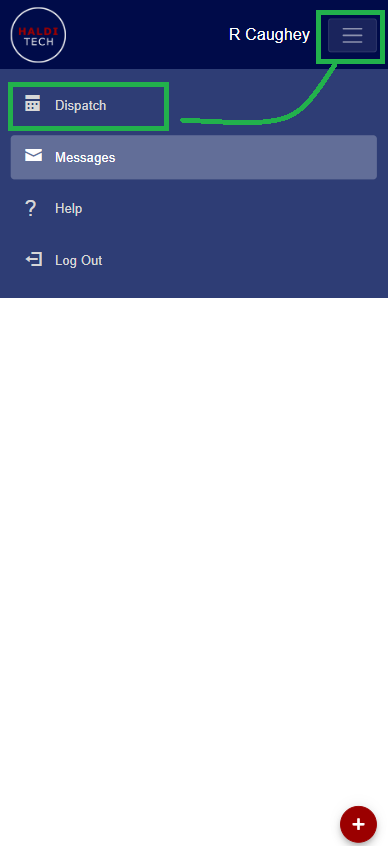
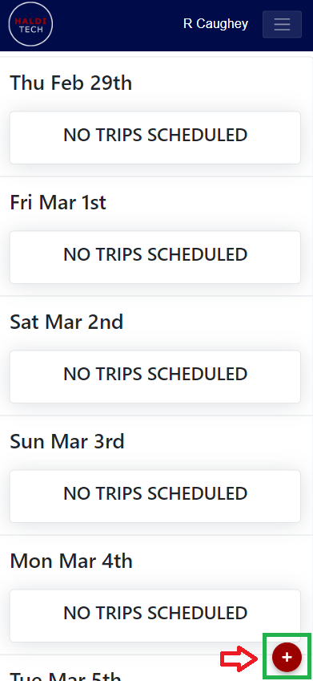
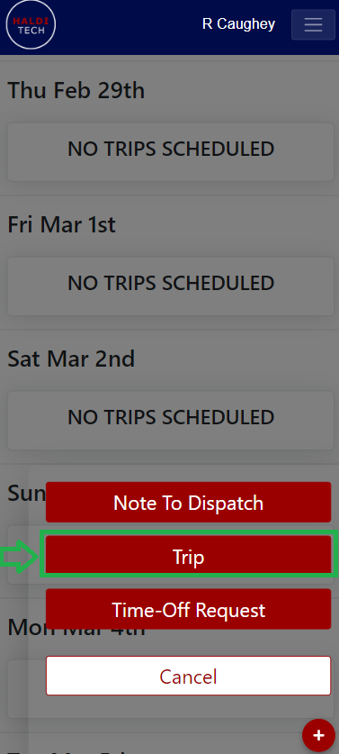
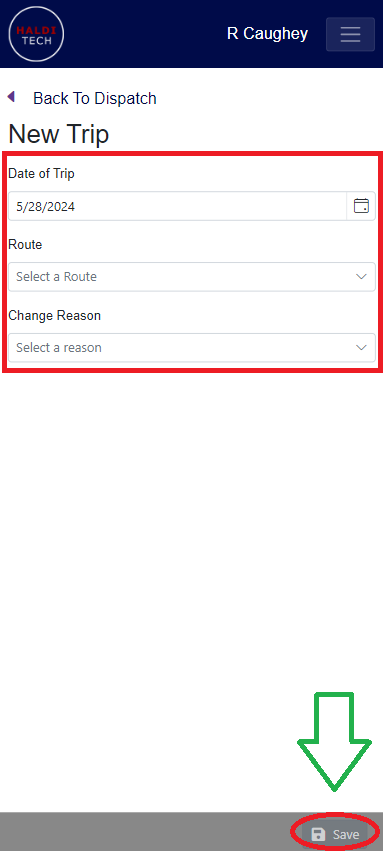

## How to add routes as driver

In your HaldiTech mobile app, click Dispatch (as shown below).

Click the red plus sign in the bottom left hand corner (as shown below).

Select the "Trip" box (as shown below).

Choose the Date of Trip, Route and/or Change Reason, and click save (shown below).

