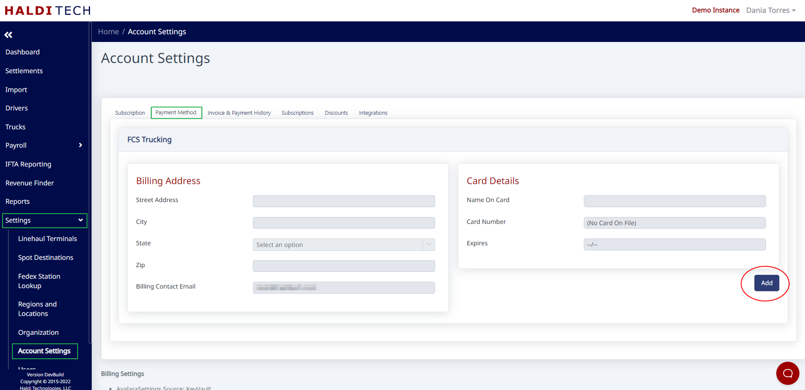

# Adding Payment Information

## Step 1. Open Account Settings

Click **Settings** >> **Account Settings** from the side menu.

## Step 2. Add a payment method

From the **Payment Method** tab, click the **Add** button.

## Step 3. Enter billing address and card details

Enter the billing address and card details.

> **Note:** You won't be able to enter the billing address until AFTER you click **Add**.

## Step 4. Save

Click the **Save** button.

