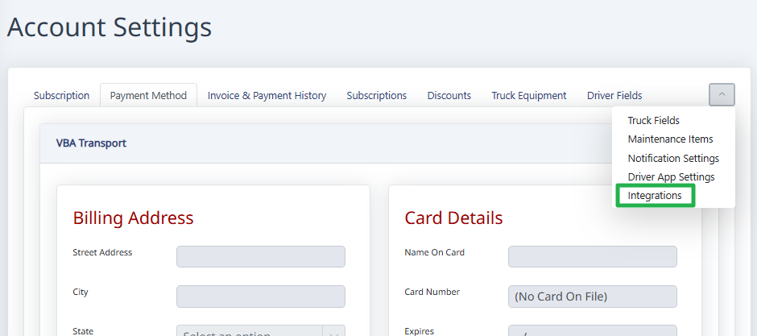
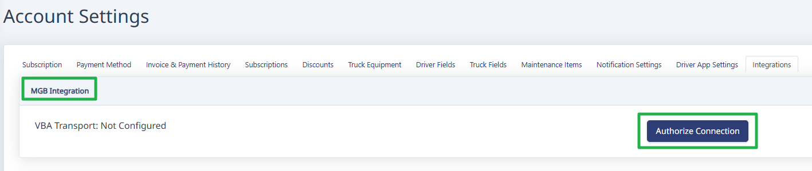
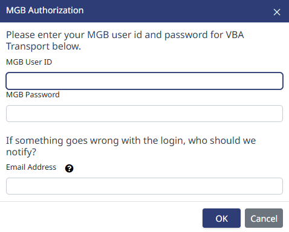

# Auto-Download Settlements

By setting up the integration with MGB, the software will auto-pull settlements on Tuesday night.

To enable this feature, go to **Settings**, then **Account Settings**, then click on the **Integrations** tab. For some users, you'll need to click on the little arrow on the right side (screenshot below).

On the integrations page, go to the **MGB Integration** section, and click the **Authorize Connection** button.

Enter your MGB credentials.

> **Note:** If you enter an email address in the box, when your password expires (every 90 days) the system will email you to let you know the credentials need to be updated.

