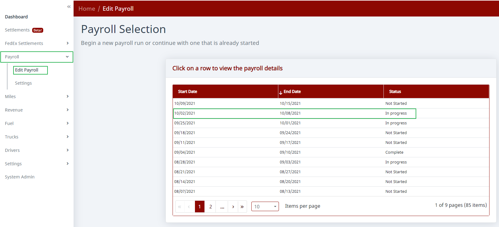
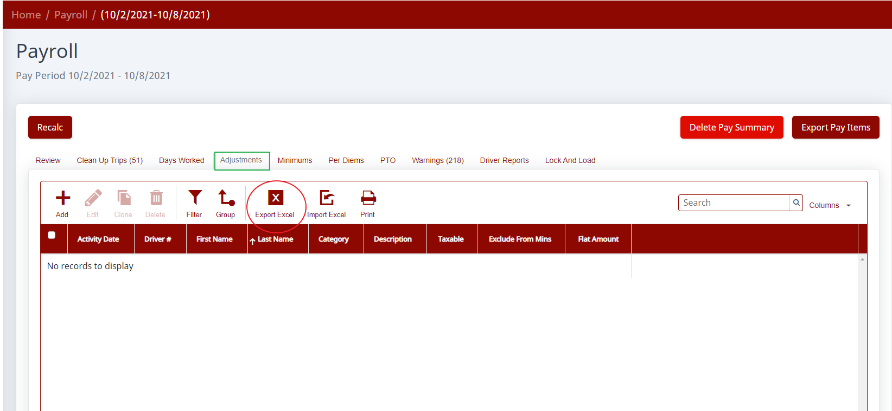
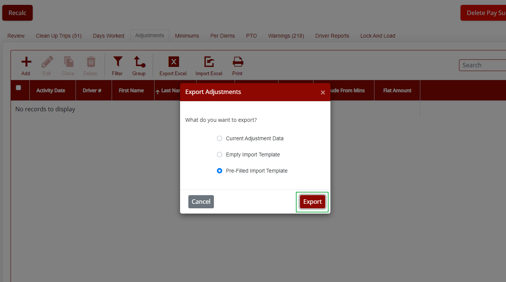
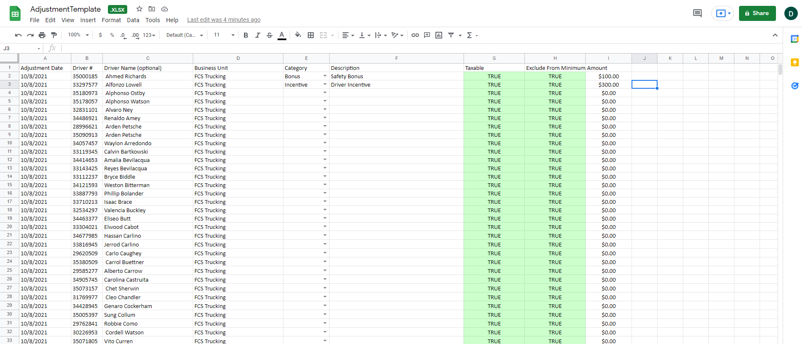
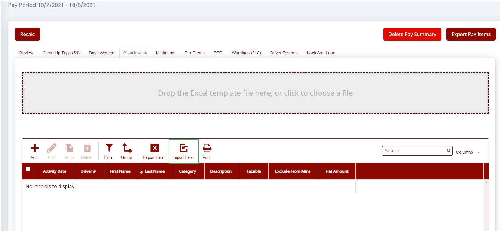

Using batch payroll adjustments saves time by letting you create all of the adjustments in Excel and then upload them to Haldi FCS at one time. For example, if you pay drivers a quarterly bonus, instead of entering each adjustment individually, you can add them all to the system with an easy upload.

## Step 1. Open the payroll

Go to the **Payroll** section on the left menu. Click **Edit Payroll** and select the payroll you want to work on.

## Step 2. Export the Excel template

Once inside the payroll you selected, click **Adjustments**, then select **Export Excel**.

You'll then get a pop-up menu. Select **Pre-filled Import Template** and **Export**.

This gives you an Excel file in a format that can be imported, with all the drivers already listed on it.

## Step 3. Edit the file

Enter the **Category**, **Description**, **Taxable**, **Exclude From Minimum**, and **Amount** columns however you'd like. You can cut and paste, add or delete rows, make multiple adjustments for one driver, and so on.

## Step 4. Import the file

Once the Excel is the way you want it, come back and click the **Import Excel** button.

Then drag your saved Excel to the box that appears and follow the prompts to batch-create the adjustments.
