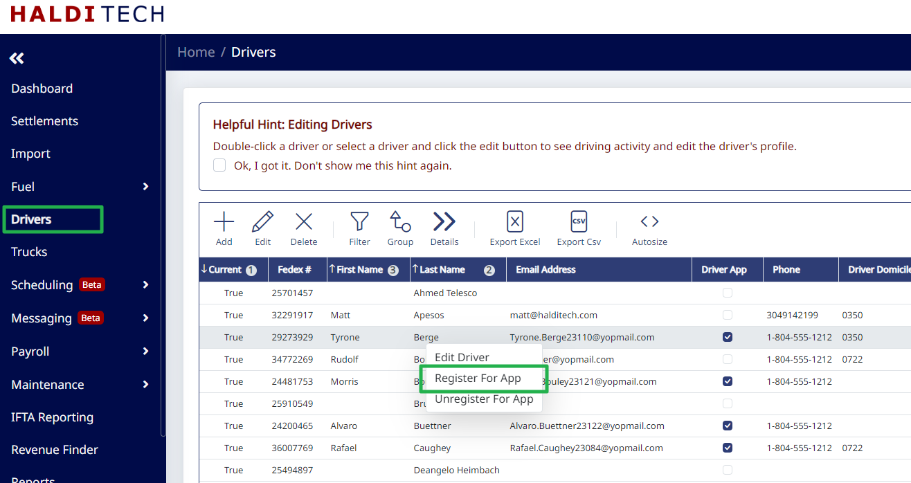
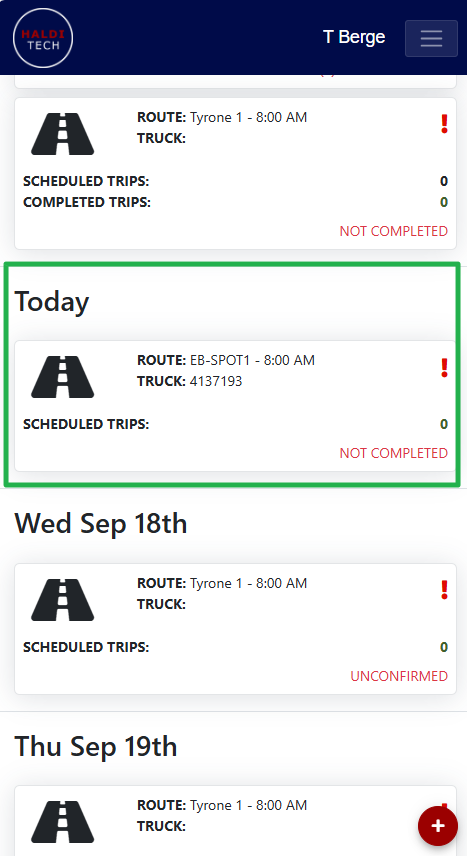
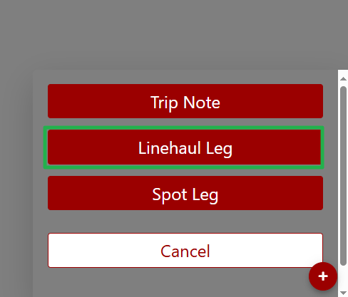

# Driver App - Getting Started

## Step 1. Enable the driver app.

To get started with the driver app, contact HaldiTech support ([support@halditech.com](mailto:support@halditech.com)) and have them enable the driver app on your account.

## Step 2. Check driver contact info.

Go to "Drivers" on the left menu. Make sure each of your drivers has an email address and phone number in their profile.

## Step 3. Register each driver for the app.

Right click on each driver, then select "Register For App". The driver will get an email with instructions for setting up his or her account.

> **Important:** If the driver has access to the main HaldiTech app (fcs.halditech.com), he or she will not be able to register for the driver app. A different email address must be used for the Driver App login.
>
> If a driver previously worked for a different TSP and has a HaldiTech profile for their old company, the system will not let you register that driver for the app. Contact support ([support@halditech.com](mailto:support@halditech.com)) and we'll get the issue resolved.

## Step 4. Configure schedule settings.

Go to "Scheduling" on the left menu, then click "Schedule Settings". Configure the settings for the driver app to your preferences.

> **Important:** If you have not set up your routes in "Routes", the drivers will not be able to enter their trip information.

## Step 5. Create and publish a schedule.

Go to "Schedules" and create a schedule. When you're ready to publish the schedule to your drivers, slide the slider at the top to publish. This will push any routes and trips to your drivers in the app.

## Step 6. Drivers open the app.

Drivers can access the driver app by opening the browser on their phone and going to [https://driver.halditech.com](https://driver.halditech.com).

## Step 7. Drivers view routes and add trips.

The default view will show any routes assigned for today. In the example below, the driver has been assigned to "EB-SPOT1", but there are no scheduled trips associated with the route. To add trips you can either:

- Enter the trips in the schedule in the main HaldiTech app, and they will flow to the driver.
- Have the driver enter the trips by tapping the route, then tapping the "+" in the lower right, and then tapping "Linehaul Leg" or "Spot Leg".

