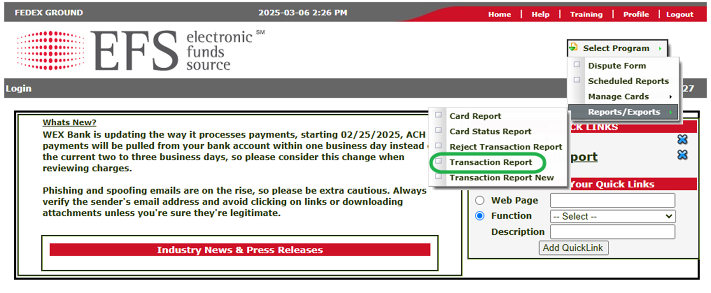
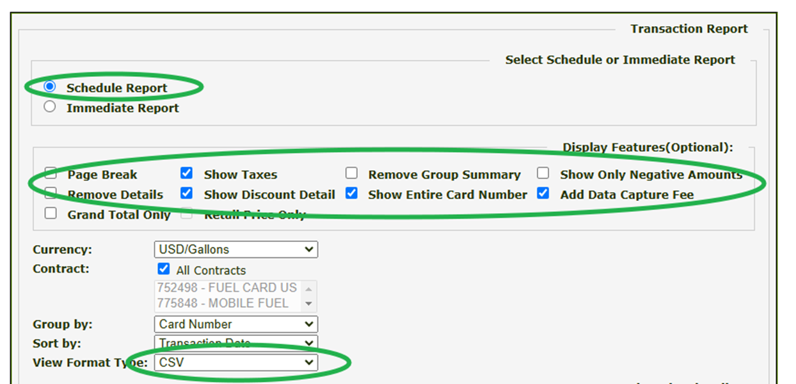
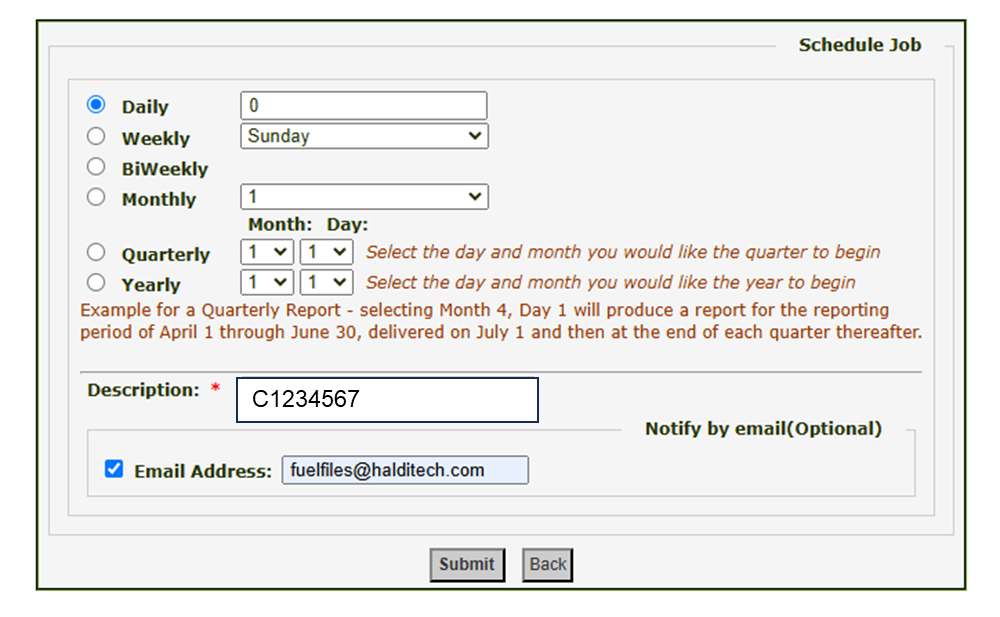
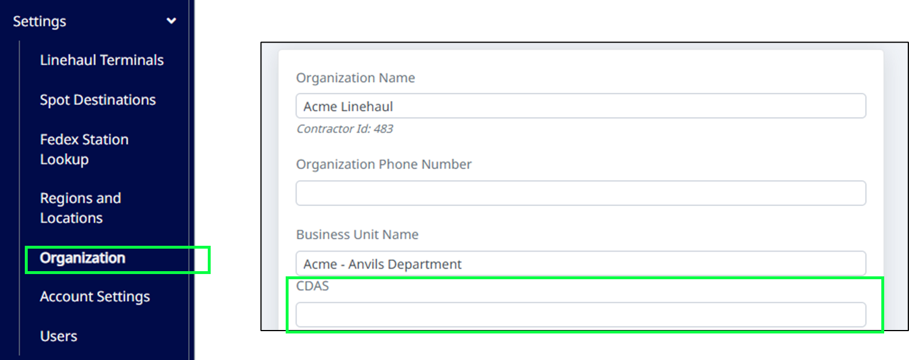

# Getting EFS Fuel Card Data into Halditech

## Step 1. Open the Transaction Report.

Log into your EFS portal. At the top, use the dropdown to select "Reports/Exports", then select "**Transaction Report**".

## Step 2. Configure and submit the report.

Check the boxes like the example below, and set the "View Format Type" to **CSV**. Click **Submit** before continuing to the next step.

## Step 3. Set the description and delivery email.

In the "Description" field, enter your CDAS number. Make sure to include the "C". Add **fuelfiles@halditech.com** as the email address, then click **Submit**.

## Step 4. Add your CDAS number in Haldi Tech.

Lastly, log into Haldi Tech, go to Settings > Organization, then add your CDAS Number.

Fuel data will automatically flow into Haldi Tech once per day, usually in the early morning hours.

**If you need help, or have issues, let us know:** [support@halditech.com](mailto:support@halditech.com)
