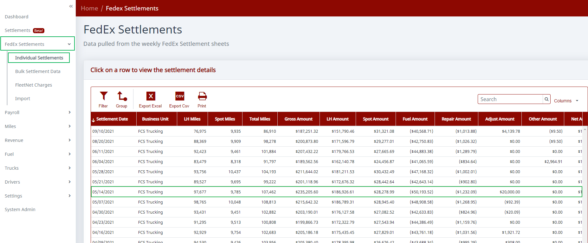
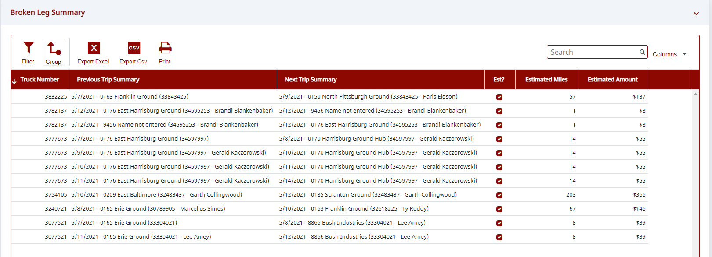

For broken legs, our software is looking for a tractor that ended at one terminal but began its next trip at a different terminal. The software isn't smart enough to know why the next leg began somewhere else, so the question you need to ask is how did that tractor get from that one terminal to the other. If it was hauling a FedEx trailer, then it didn't show up on the settlement and you didn't get paid for that leg. If it was a bobtail or similar, then the software thinks it's a broken leg, but needs a human on your side to determine that it wasn't. A lot of times it's a case where FedEx put the wrong destination on the settlement. You got paid correctly, it's just that FedEx had a data error (we have no way of knowing).

The broken legs listed on the dashboard are just a summary and are not exportable. Here is a better way to look at that info:

1. Click on "FedEx Settlements" and then "Individual Settlements" and you'll see a list of the settlements you have loaded. Click on the week you want to see detail for (Screenshot 1 below).
2. You'll see a bunch of grids — "Summary", "Linehauls", "Spots", etc. This is detailed info from the settlement and we've added things like driver name and terminal name to make it easier to work with. You can click the "Export Excel" button at the top of any grid to download.

   > **Note:** There is a known issue with the "Export Pdf" button and it isn't working properly right now.

3. Scroll down that page until you come to "Broken Leg Summary". This is a more usable view that you can download to Excel (Screenshot 2 below).

   > **Note:** The amounts listed are estimated based on other trips between the two terminals. If you don't have another set of trips between those specific terminals on the settlement, the estimated amounts will be blank.

