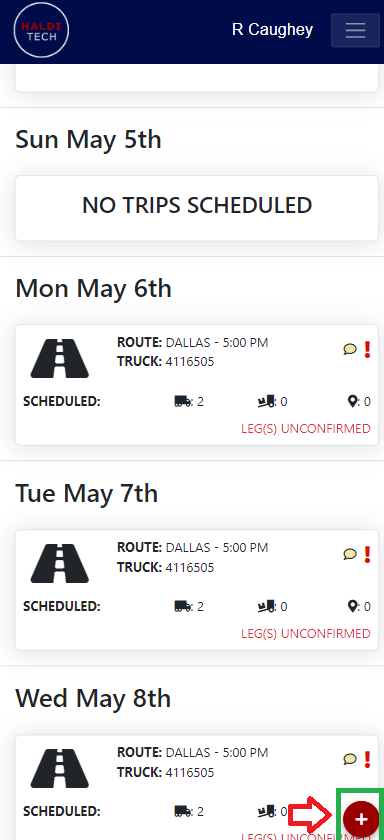
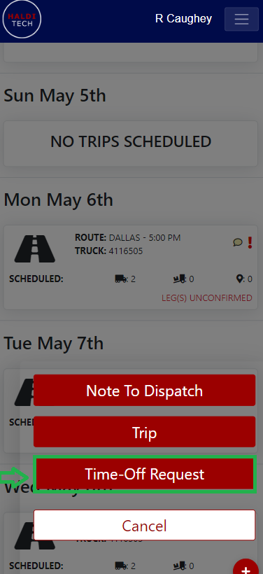
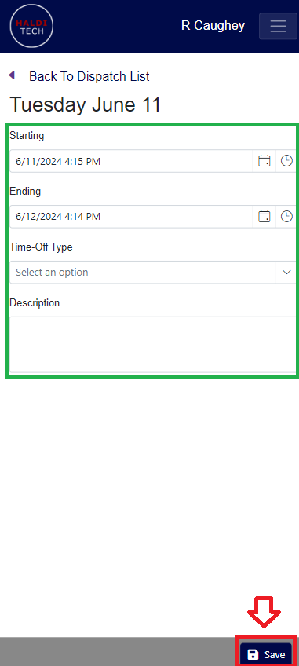

# Requesting Time Off

- In the dispatch screen in the mobile app, click the red plus sign in the lower right-hand corner (shown below).

- Select **Time Off Request** (shown below).

- Select the starting date, ending date, time off type, and description, then click **Save** (shown below).

