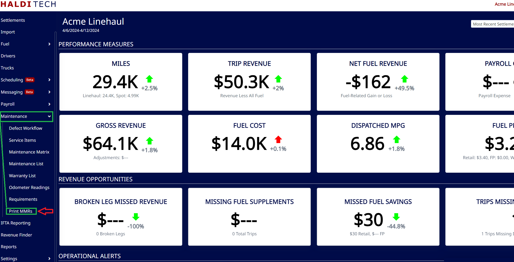
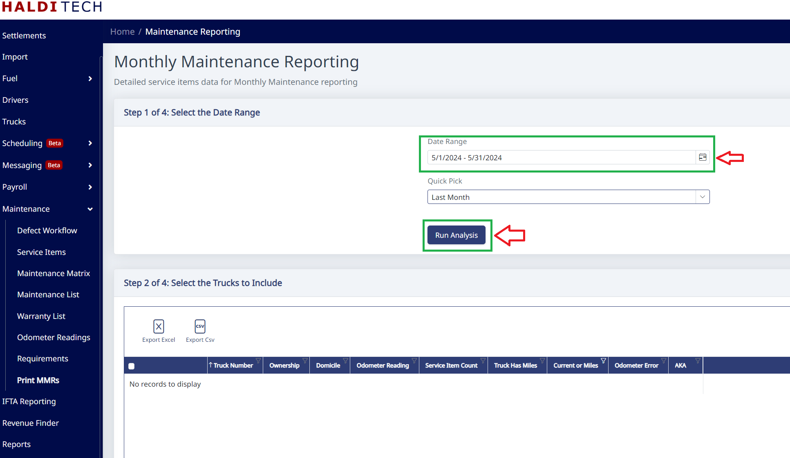
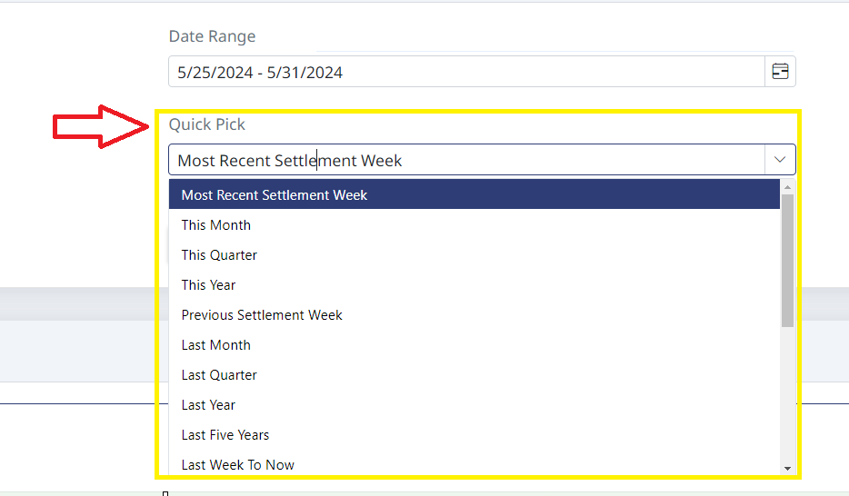
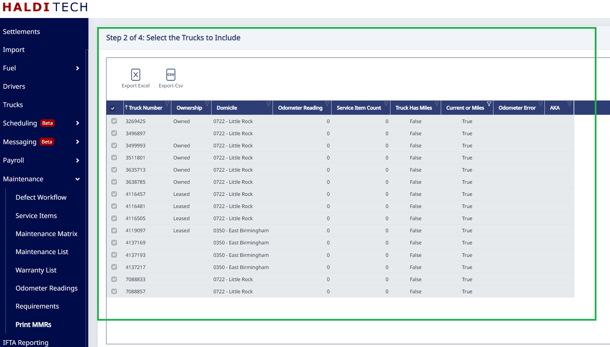
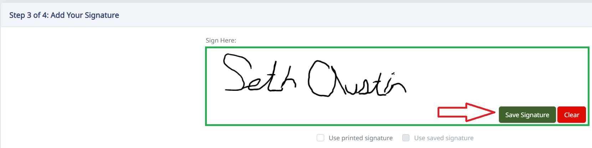
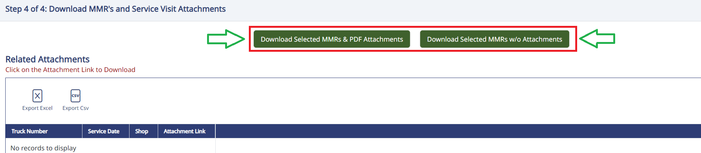
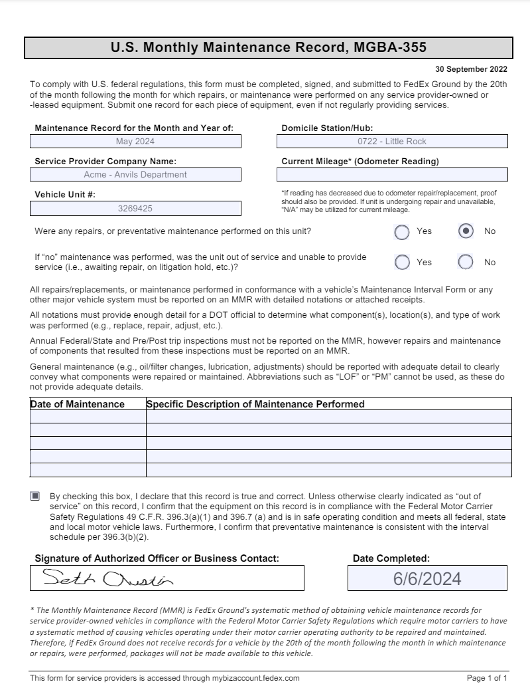
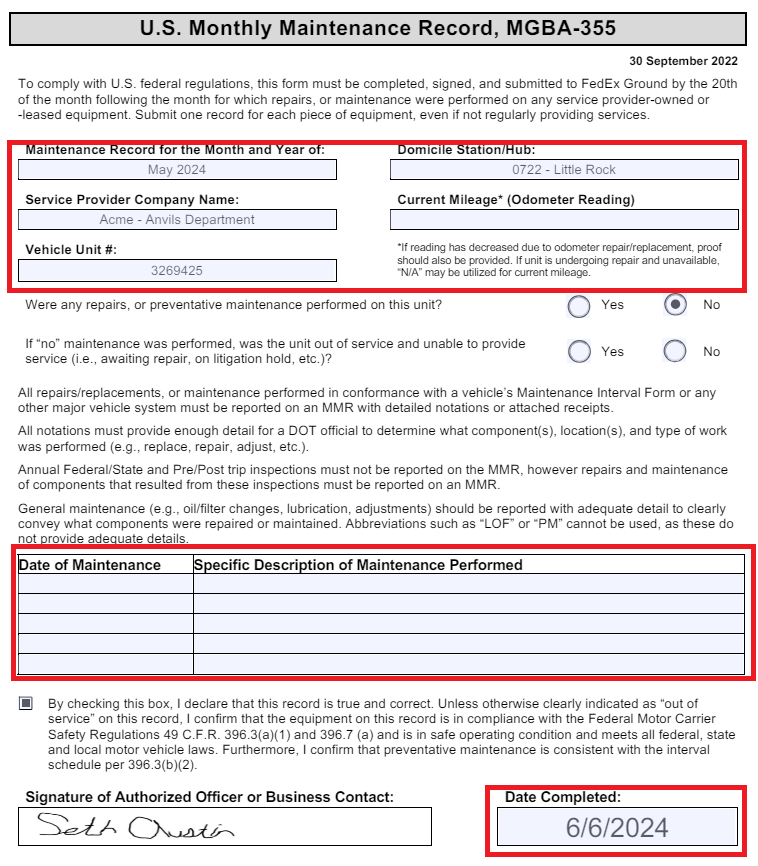

## Accessing MMRs

From your HaldiTech dashboard, select the Maintenance drop-down tab and then select "Print MMRs" (example below).

You have the option to select a custom date range or settlement intervals (quick pick) and click "Run Analysis" (example below).

Selecting "Quick Pick" will give you access to MMRs from last month, quarter, and year (example below).

Select the trucks that you wish to include in your MMR (see below).

Add your signature below and click save (example below).

You may download the MMRs with or without attachments.

The PDF will download and look similar to the example below.

To make adjustments to your MMR, simply click in the grey boxes of your PDF (see below).

