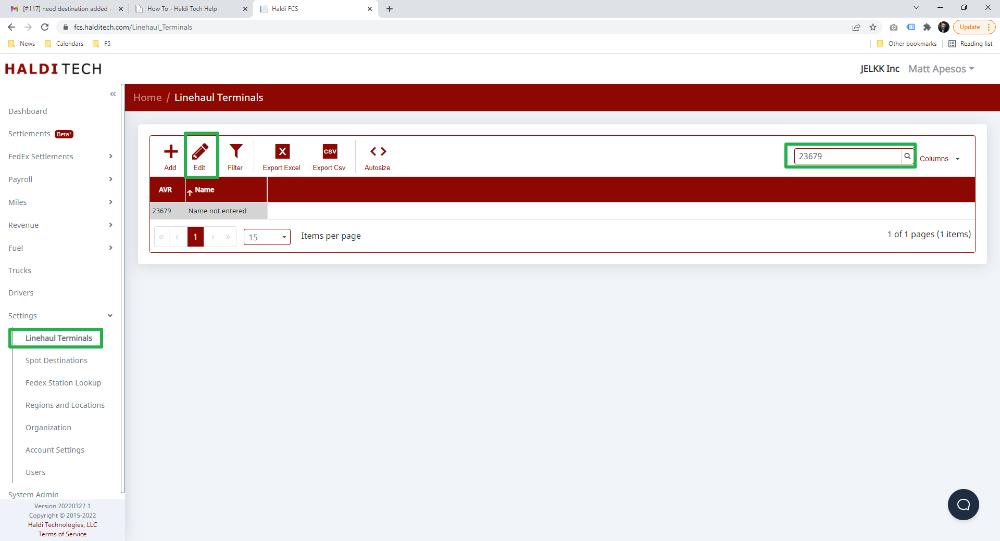
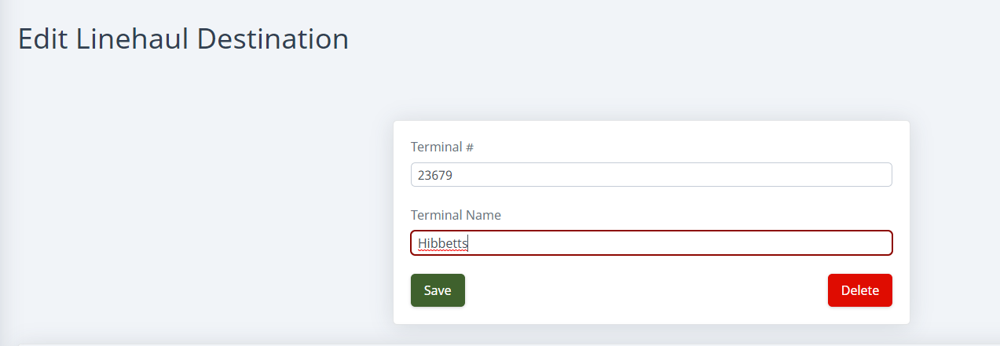

1. Go to **Settings > Linehaul Terminals**.
2. Type the station number you're looking for in the search box and hit Enter.
3. Select that station from the list and click the **Edit** button.
4. Add the terminal name and click **Save**. The name will automatically update throughout the system.

