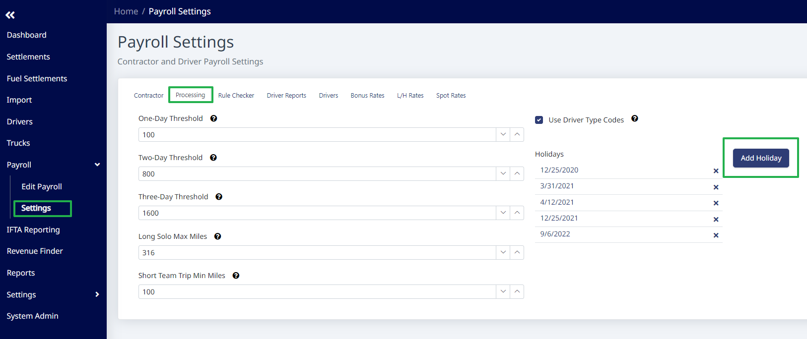
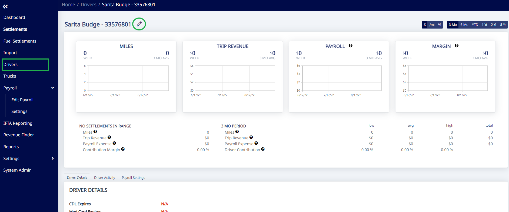
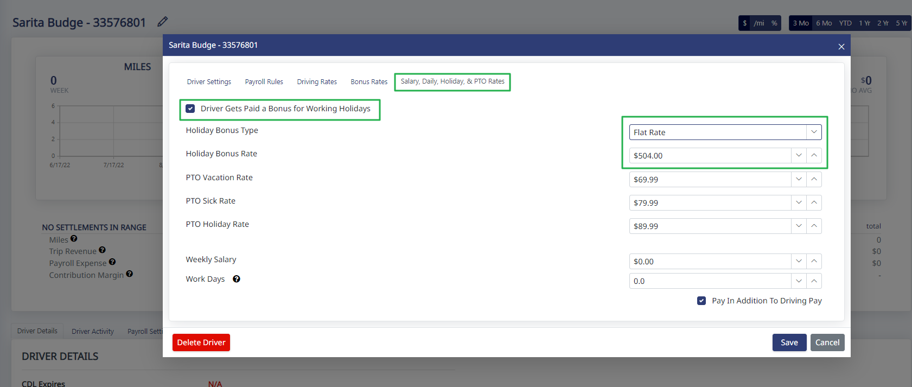

To add Holidays, first go to "Payroll" > "Settings" on the side menu. On the "Contractor" tab, select "Use Holiday Bonuses". On the "Processing" tab, click the "Add Holiday" button and enter the date you want to pay a holiday bonus for.

Once you set the holidays, you have to turn on the Holiday Bonus for each eligible driver and set a holiday bonus amount. To do that, open each driver's settings and go to the "Salary, Daily, Holiday, & PTO Rates" tab. Check the box "Driver Gets Paid a Bonus for Working Holidays" and then select the Holiday Bonus Type and enter a Holiday Bonus Rate for that driver and click "Save".

Once that is done, the system will automatically add that Holiday Bonus to that driver's pay when he or she works on that day.

> **Note:** The bonus is added to the driver's normal driving rates, it does not override them.

To be clear, the system will only apply the Holiday Bonus when the dispatch date on the settlement matches the holiday date set. For example, if you set 11/24/22 (Thanksgiving) as a holiday, but the driver is dispatched on 11/23/2022 at 11:59pm, the system won't add the bonus.

