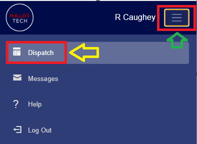
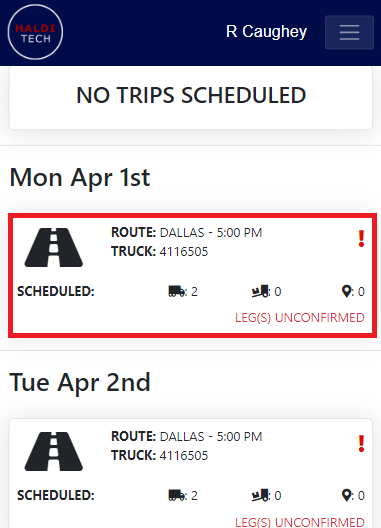
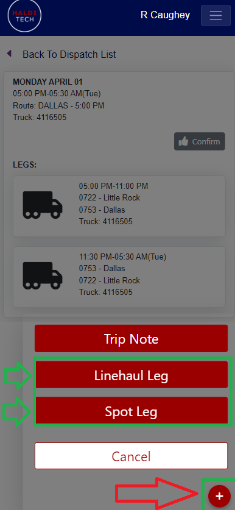
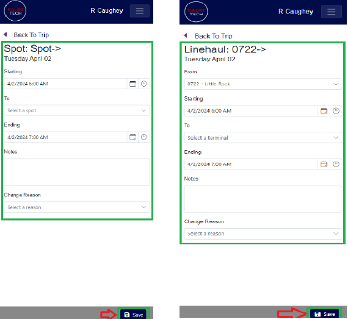

## Step 1. Open dispatch

In your HaldiTech mobile app, click the 3-line icon in the top right, next to the driver's name, and click **Dispatch**.

## Step 2. Select a scheduled trip

Select a scheduled trip by clicking in the box.

## Step 3. Add a leg

Click the red plus icon in the bottom right of the mobile app and click **Linehaul Leg** or **Spot Leg**.

## Step 4. Enter the details and save

Input all required information and click **Save**. The example below applies to both a Linehaul Leg and a Spot Leg.

