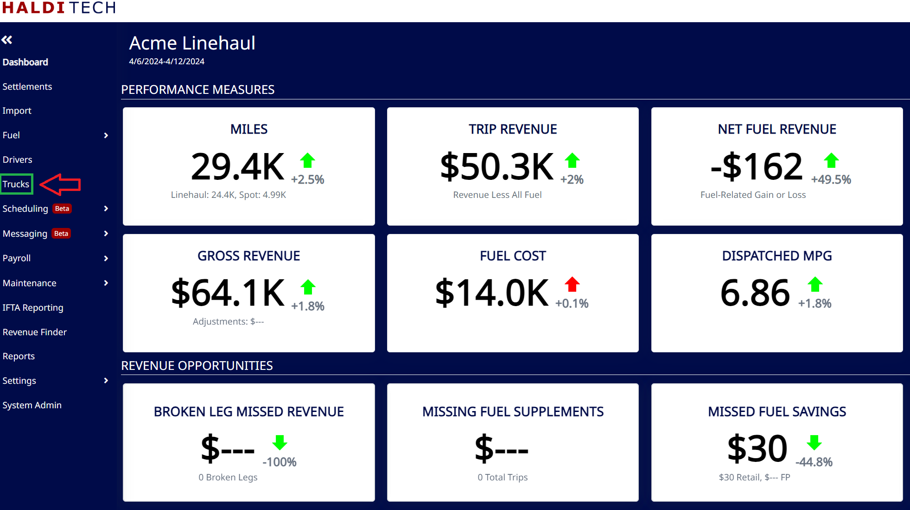
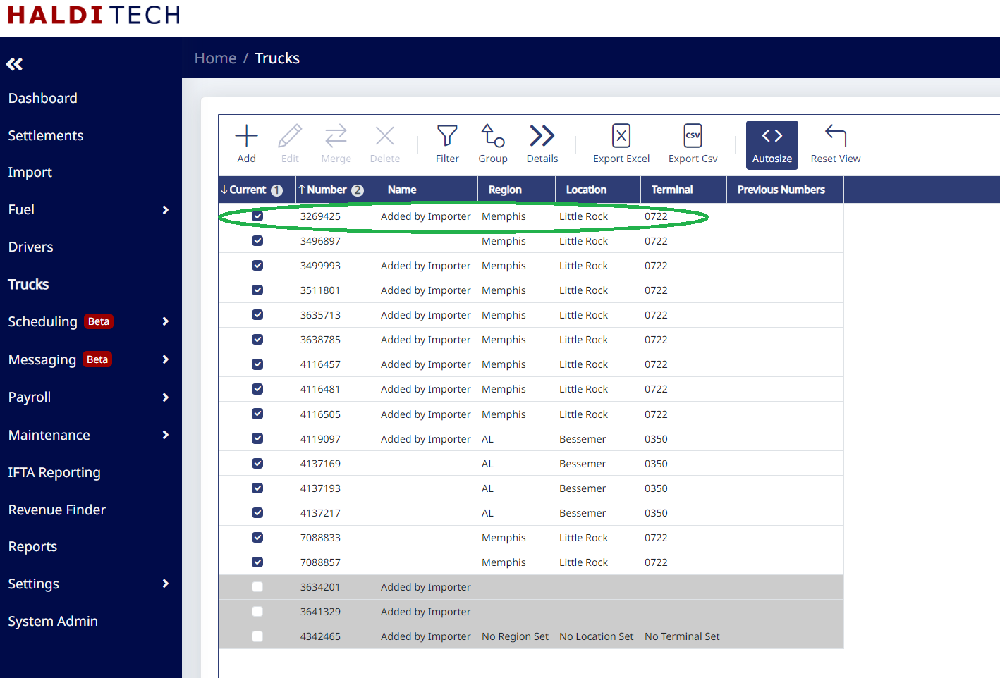
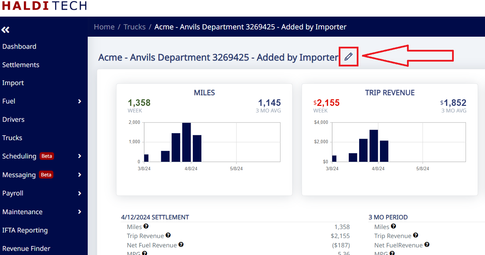
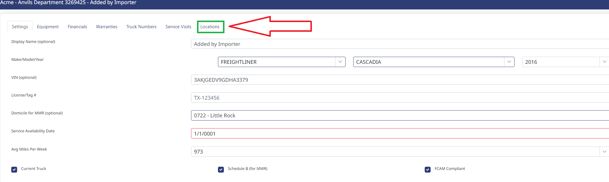
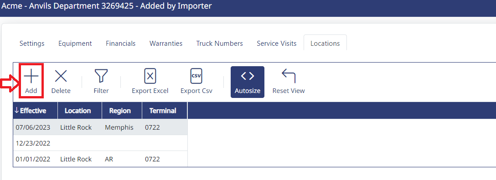
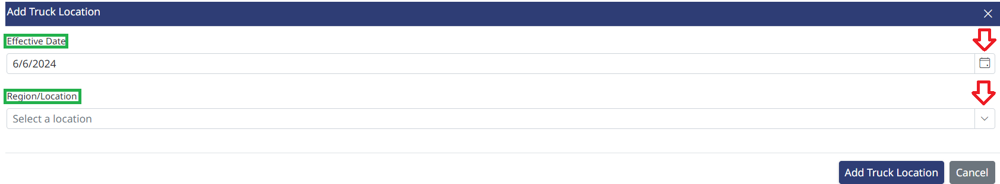
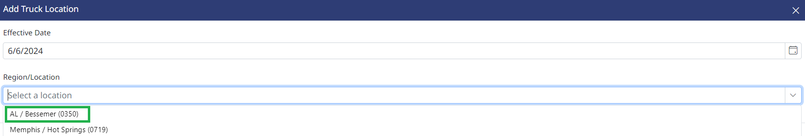
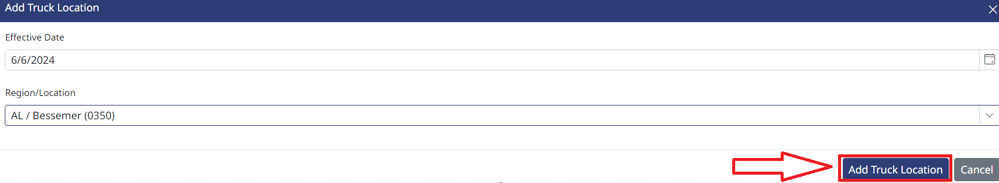
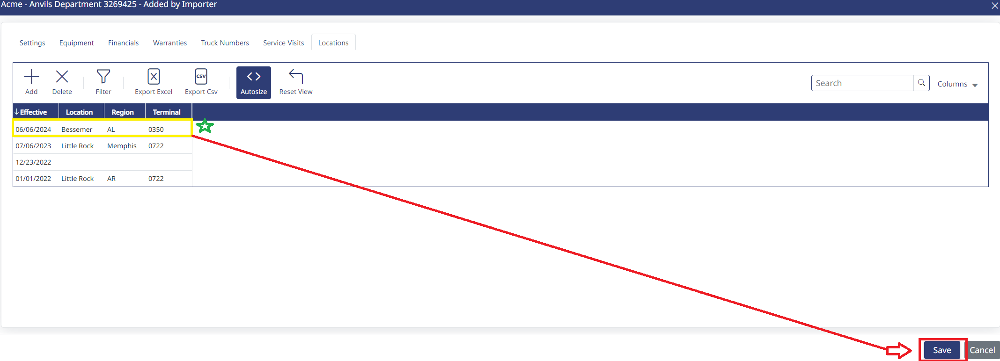

## Adding Locations

From your HaldiTech dashboard, select the "Trucks" tab (shown below).

On the next screen, you will see your list of trucks. Using your mouse cursor, double click into the truck number that you want updated (see below).

Click the pencil icon to edit truck (see below).

Click on the Locations tab (see below).

Click the add icon (see below).

Choose the **effective date** by clicking the calendar icon and then choose the **region/location** by clicking the drop down box (see screenshot below).

Select the location from the drop down (example below).

Click the Add Truck Location icon (screenshot below).

The location in the example below (Bessemer, AL) has been added. Click the **Save** icon for completion (screenshot below).

