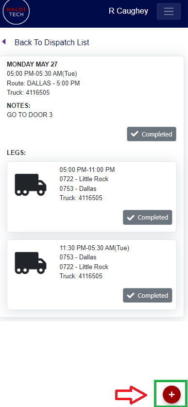
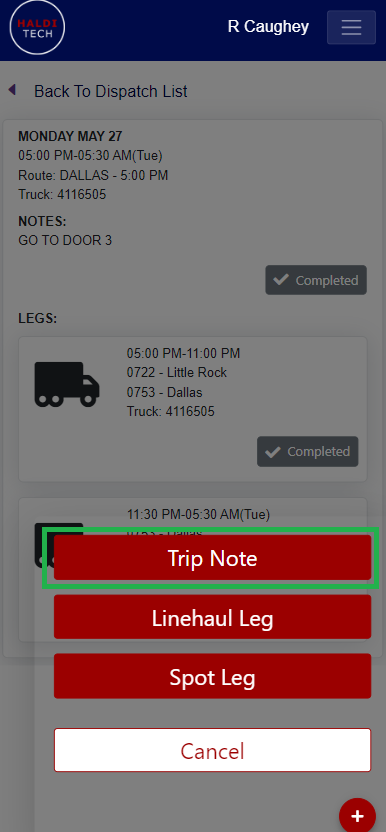
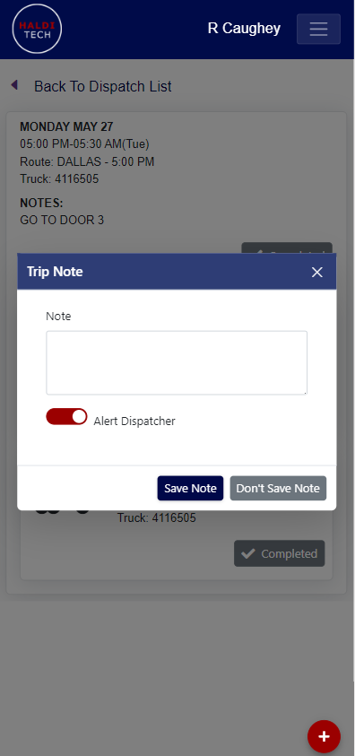

# How to add notes as a driver in the mobile app

## Step 1. Open the add menu.

You may add trip notes in your mobile HaldiTech app by clicking on the red plus icon (shown in the screenshot below).

## Step 2. Choose Trip Note.

Click Trip Note (shown in the screenshot below).

## Step 3. Save the note.

Add your note in the box below and click "Save Note".

