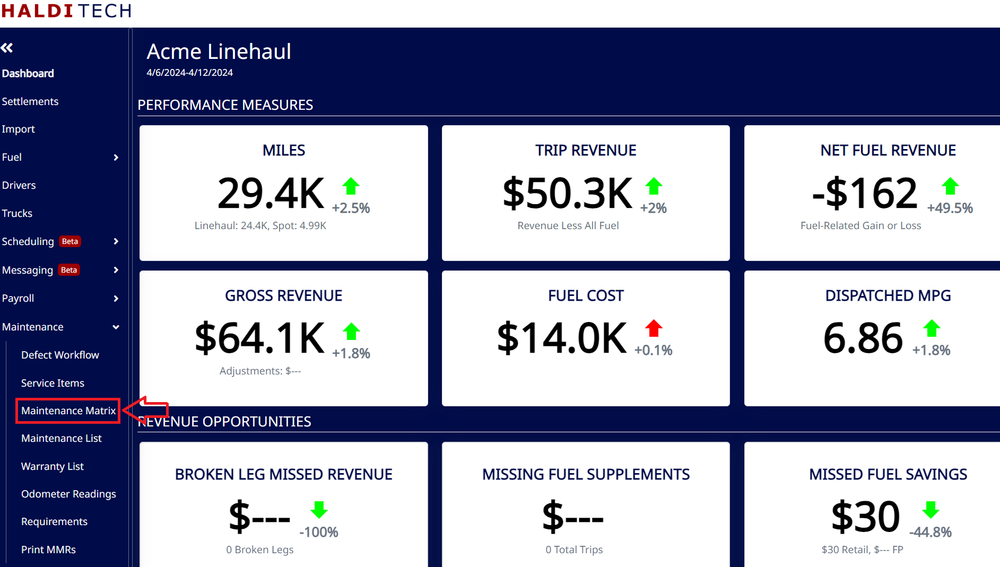
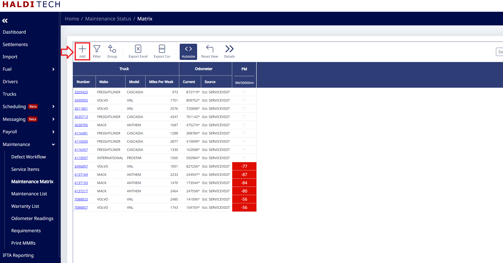
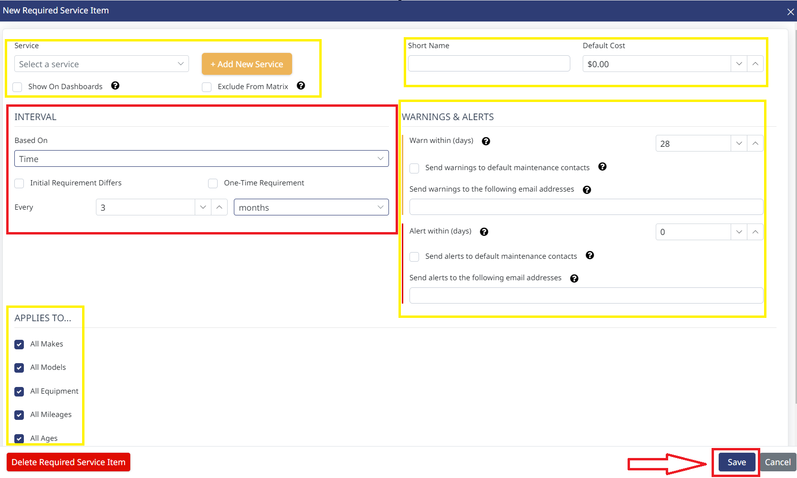

## Step 1. Open the Maintenance Matrix

In your HaldiTech software, select the **Maintenance Matrix** under the **Maintenance** drop-down.

## Step 2. Add an interval

Click the **Add** icon.

## Step 3. Fill in the details and save

Fill out the highlighted information and click **Save**.

