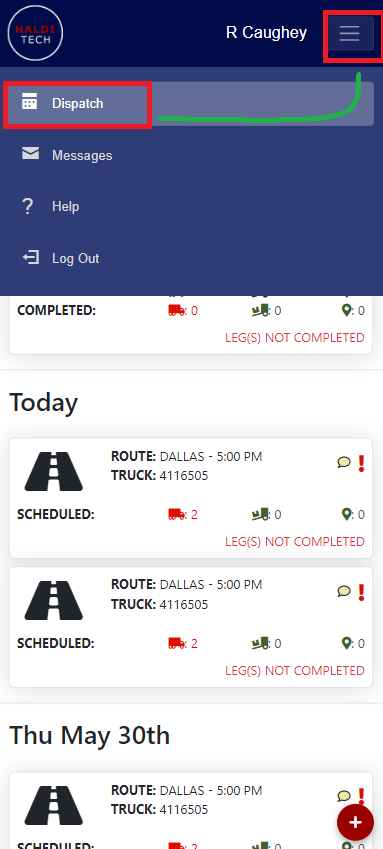
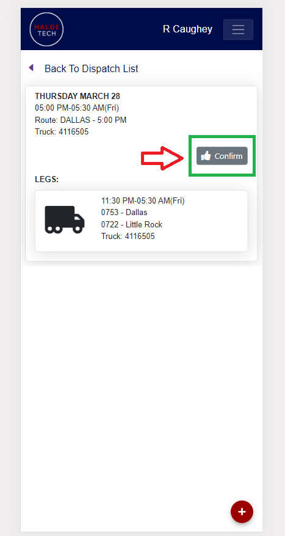

# Confirming Trips

- On the top right of your mobile app, click the box in the top right corner next to the driver name and select **Dispatch** (shown below).

- Scroll down to locate the route you want to confirm, then click the **Confirm** box (shown below).

