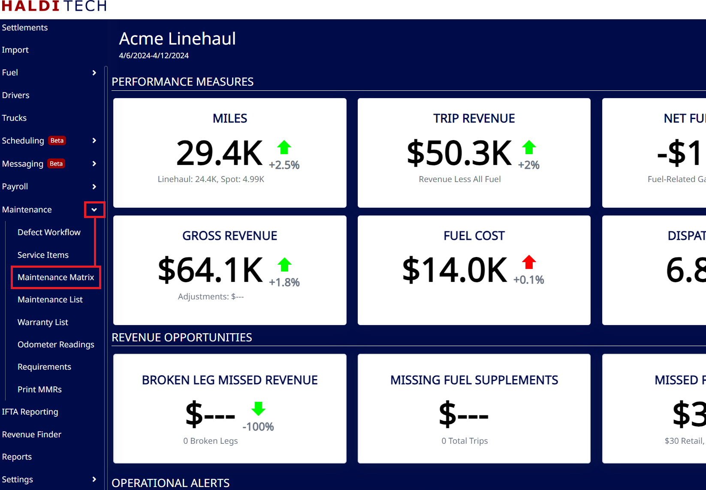
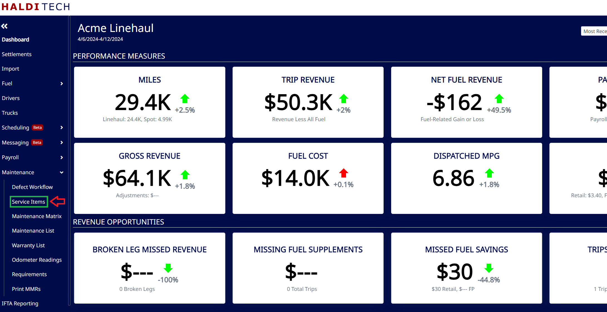
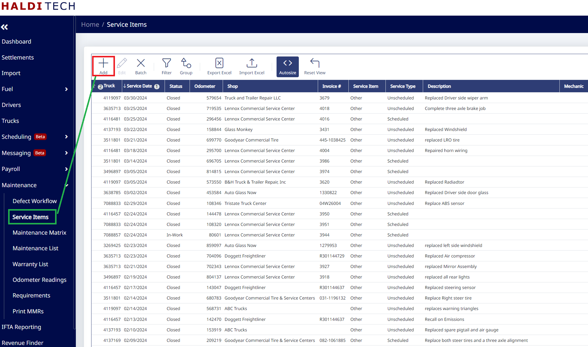
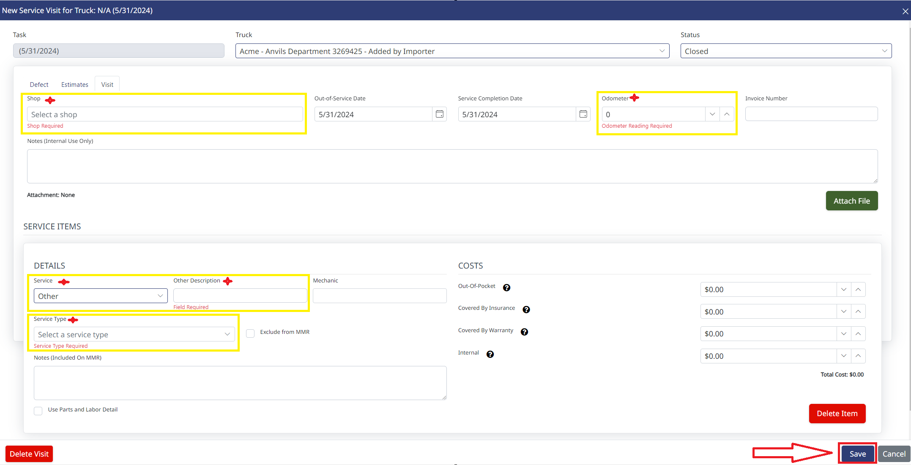

## Creating Service Tickets

In your HaldiTech software, select Maintenance Matrix (see below).

Select the "Service Items" (example below).

Select the "Add icon" (shown below).

On the next screen, fill out the information highlighted in the example below and then click save (see below).

> **Note:** FedEx requires a description for the service.
