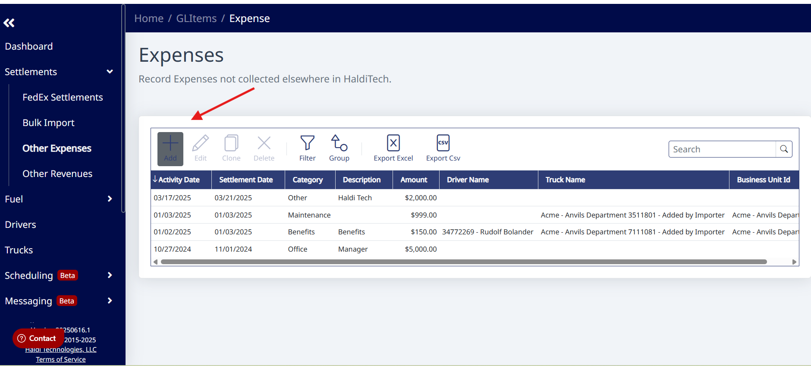
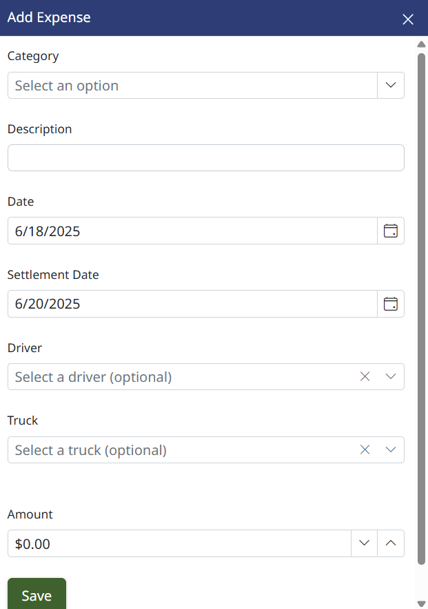

# Using Other Revenues & Expenses

Add revenues and expenses that are not included on your FedEx settlements.

## Step 1. Open Other Expenses or Other Revenues

Click **Settlements** and select either **Other Expenses** or **Other Revenues**.

## Step 2. Add a new record

Click the **+ Add** button to create a new expense or new revenue.

## Step 3. Enter the details

Select a **Category** using the dropdown, type in a **Description**, and select the date that the expense or revenue took place. Optionally, you can associate the revenue or expense to a **Truck** or **Driver**. Enter the dollar amount.

> **Note:** You cannot create revenues or expenses that will recur weekly or monthly at this time.

## Step 4. Save

Once you click **Save**, your expense or revenue is now included in reporting and the Haldi Tech P&L.

---

**Need Help?** [support@halditech.com](mailto:support@halditech.com) or call us at 470-594-2534
