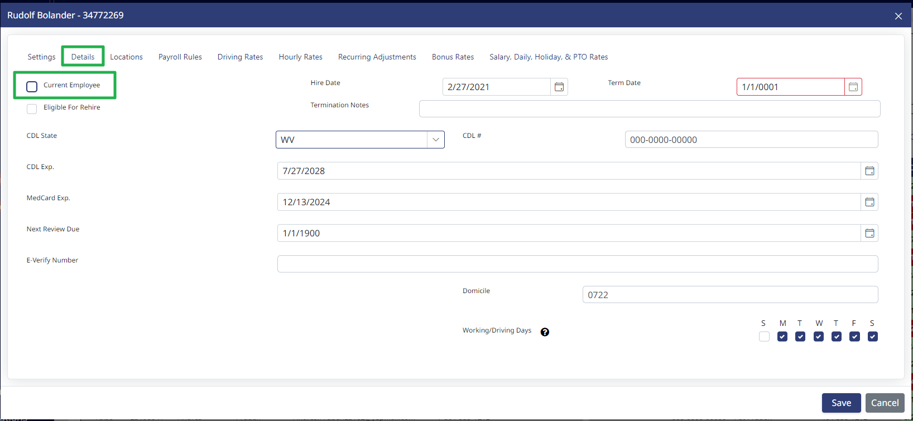
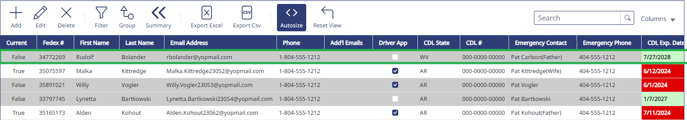
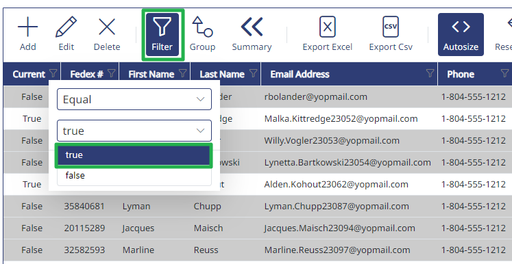

Instead of permanently deleting a driver, you must mark them as no longer working for you.

To do this, go into a Driver's profile, then click on the "Details" tab, then uncheck the "Current Employee" box.

After the "Current Employee" box is unchecked, you will see options to enter a termination date, termination notes, and be able to flag the driver as eligible for rehire. These fields are optional.

Once a driver is marked as not current, they will display in the list of drivers in grey. They will also no longer show up in Payroll, Scheduling, or Messaging.

If you no longer want to see them in the list, use a filter on the "Current" column, and set the filter to "True".

