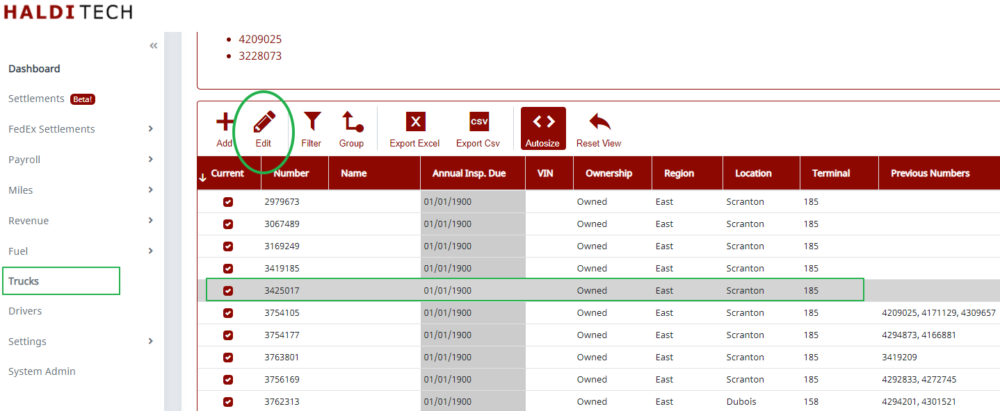
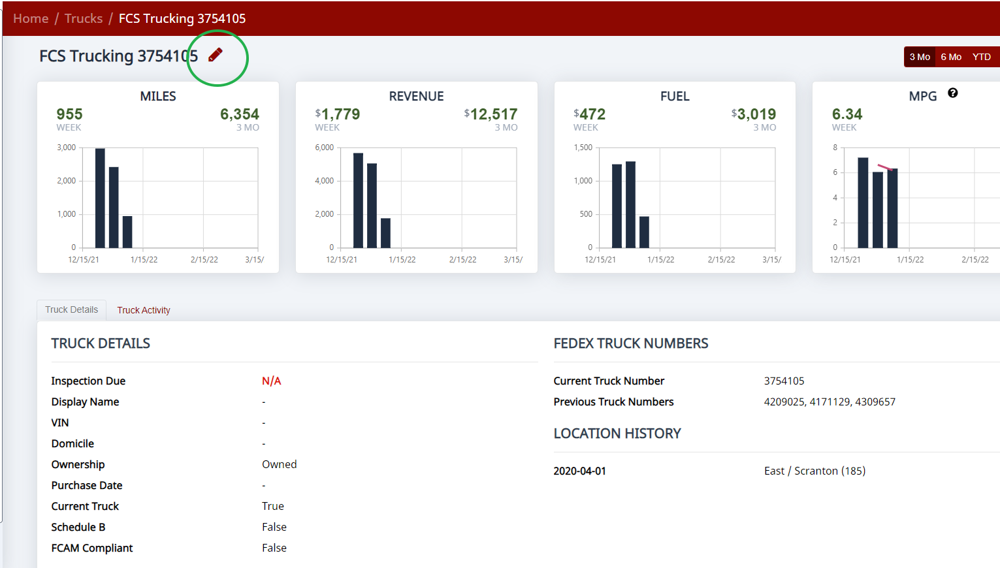
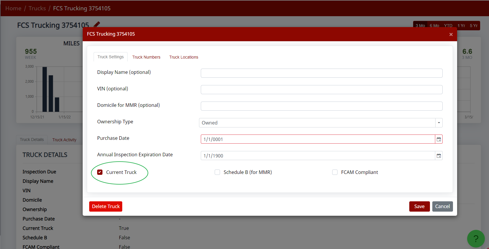

Instead of deleting trucks, it is best to change their status to inactive.

## Make a truck inactive

Go to **Trucks**, click on the truck you want to change the status of, and click **Edit**.

Click **Edit** next to the truck number.

In the truck edit screen, uncheck the **Current Truck** box and click **Save**.

## If the truck number changed

If it's the same truck but the number has changed, you can add the new number by going to the **Truck Numbers** tab inside the truck edit screen. Once the number has changed, you don't need to do anything for the old truck.

> **Note:** If you delete a truck from the truck list, any time you open a settlement that has the deleted truck, it will automatically re-add the truck to your list — trucks are created automatically from the settlement data.
