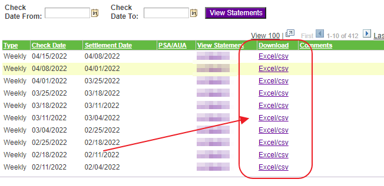
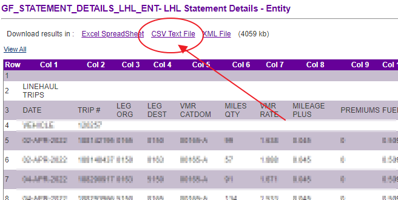

# How to download CSV settlement files from MyGroundBiz

## Step 1. Choose the settlement.

Go to MyGroundBiz. Choose the settlement you want to download and click Excel/CSV.

## Step 2. Download the CSV Text File.

When you open a settlement, click on the link for the CSV Text File as shown below.

