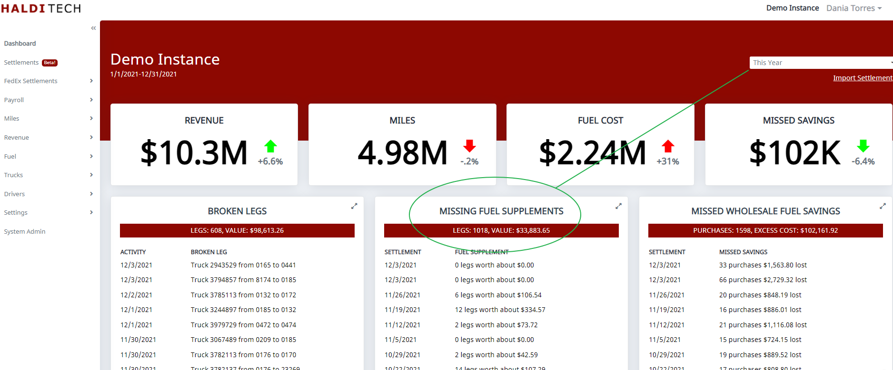
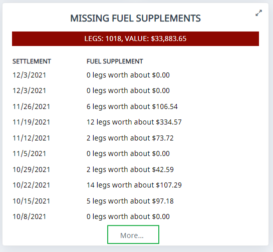
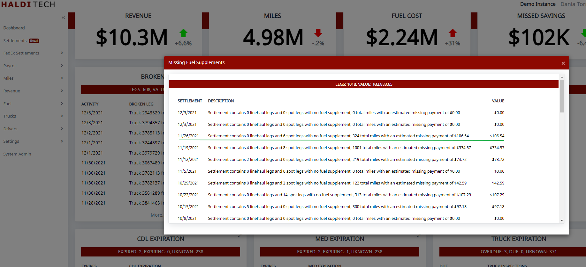
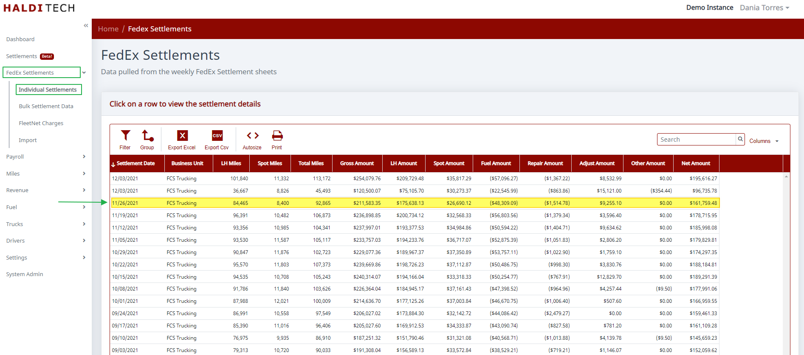
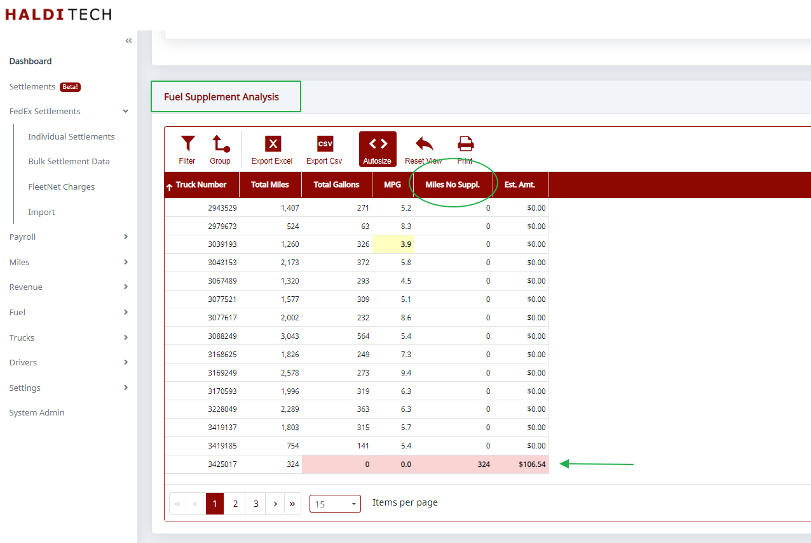

# How To Find Missing Fuel Supplements

## Step 1. Select a date range.

Log into your HaldiTech account. On the top right of your dashboard, select the date range you want to see data for. In this case, we will use "This Year".

## Step 2. Load all the data.

Click on "more" to load all the data for the date range selected.

## Step 3. Identify the settlement with a missing payment.

In this example we see the settlement from 11/26/2021 has a missing payment of 106.54.

In order to view insights for this settlement, go to "FedEx Settlements" in the left menu bar. Click on individual settlements. Then click on the settlement you want to view insights for and wait for it to load.

## Step 4. Review the fuel supplement analysis.

Scroll down to the fuel supplement analysis. The column labeled "Miles no Suppl." shows you which trucks didn't get paid a fuel supplement.

