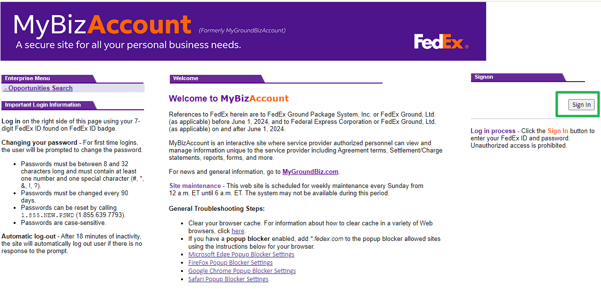
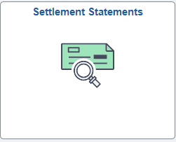
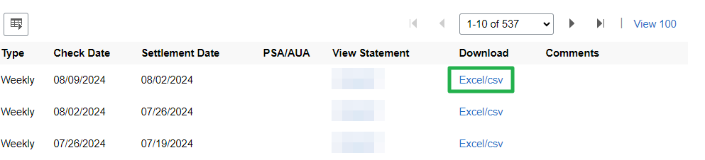
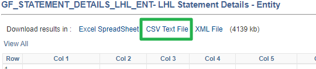
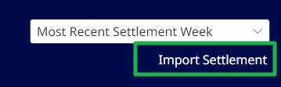
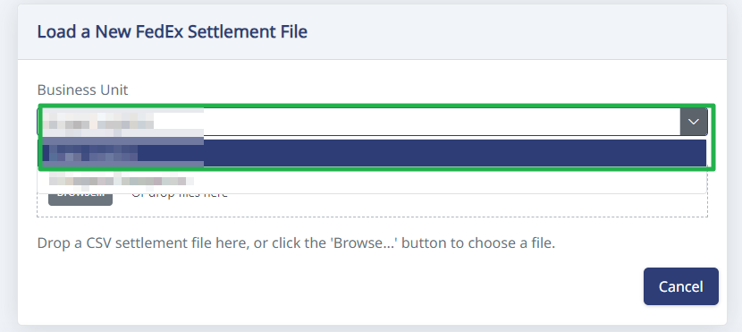

# How to Import Settlements

## Step 1. Sign in to MyGroundBiz.

First, go to your MyGroundBiz Portal and sign in.

## Step 2. Open Settlement Statements.

Click on Settlement Statements.

## Step 3. Download the settlement as a CSV.

Find the settlement you want to work on. Download it as a CSV file.

Then click "CSV Text File" to download.

## Step 4. Start the import in HaldiTech.

Log into your HaldiTech account. In the upper right of the dashboard, click "Import Settlement".

> **Important:** If you have more than one contract, you'll need to select the company from the dropdown before uploading the settlement.

## Step 5. Upload the CSV file.

Drag and drop the CSV file or click the Browse button and upload the file.

