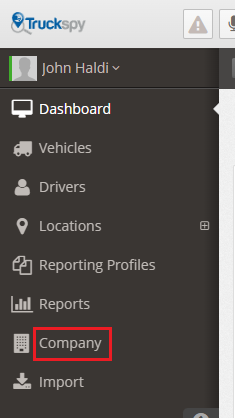
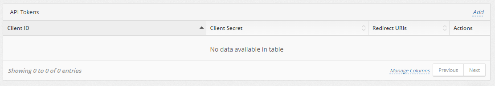
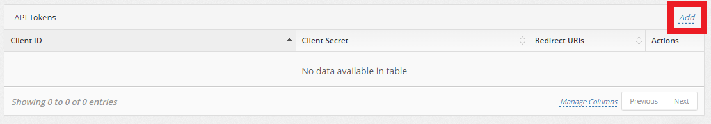
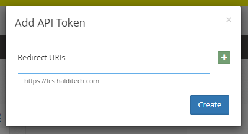
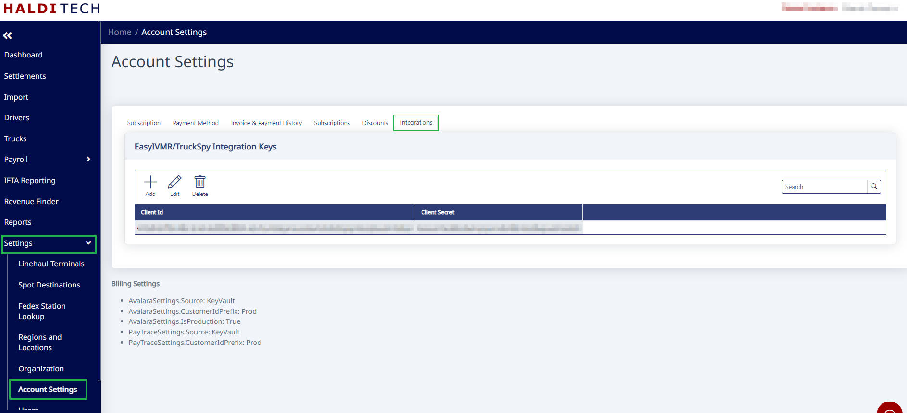
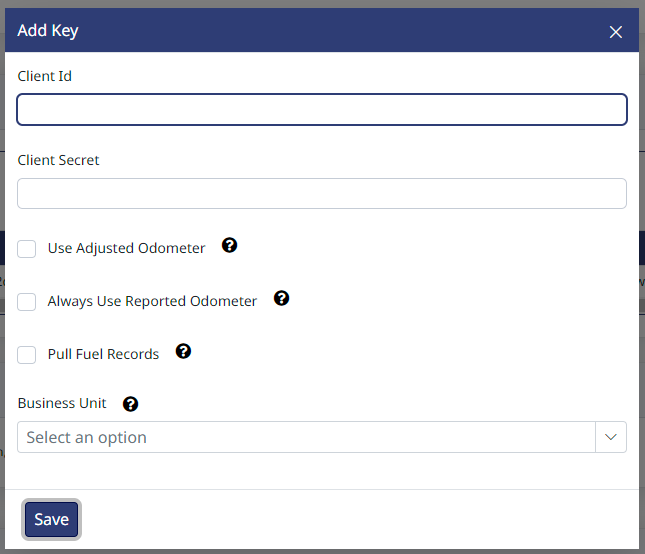

# How To Integrate with TruckSpy

1. Log in to TruckSpy as you normally would.

2. Click on the 'Company' tab on the left part of the screen.

   

3. Look for the 'API Tokens' section on the right side.

   

4. If you've already created tokens, you should see them there — skip to step 6.

5. If you do not have API Tokens in TruckSpy, click the 'Add' link in that API Tokens section. That will open a window to prompt you for a Redirect URI. Enter: [https://fcs.halditech.com](https://fcs.halditech.com). Then click Save and TruckSpy will create a Client ID and Client Secret for you.

   

   

6. Open HaldiTech in another tab and go to the Integrations tab (under Settings → Account Settings).

7. Edit the Integration Key you have in there, or create a new one if there isn't one there already.

   

8. Copy the Client Id from TruckSpy (step 4/5 above) and paste it as the Client Id in HaldiTech.

9. Do the same for the Client Secret. Click "Save".

10. The default is "Reported Odometer", but you can select to use the "Adjusted Odometer" being reported by TruckSpy.

    
