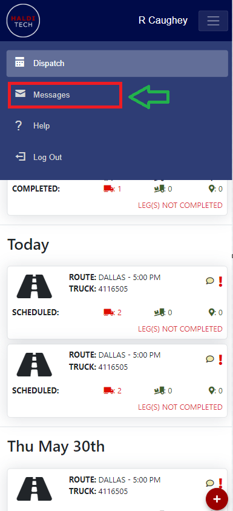
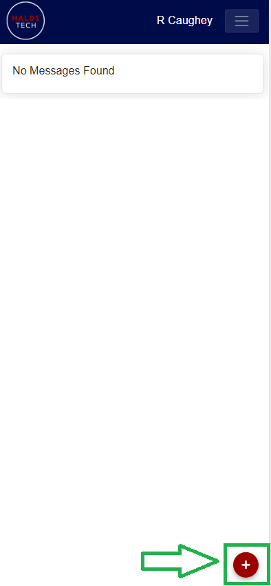
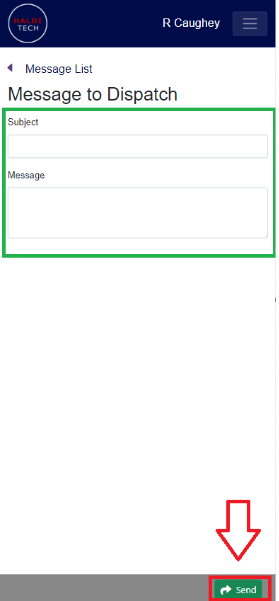

# How to message your dispatcher

- In your mobile app, click **Messages** (shown below).

- Click the red plus icon in the lower left-hand corner of the mobile app (shown below).

- Input the subject and message, then click **Send** (shown below).

