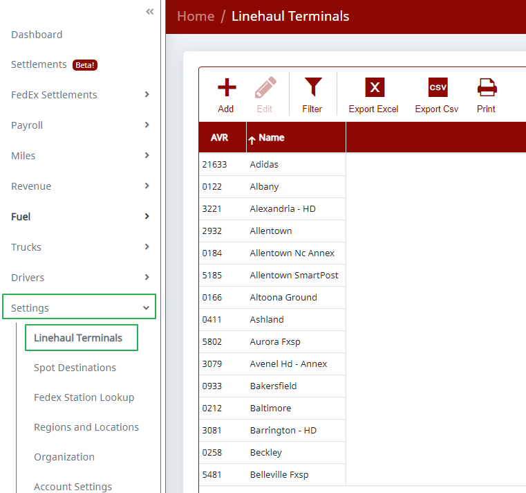
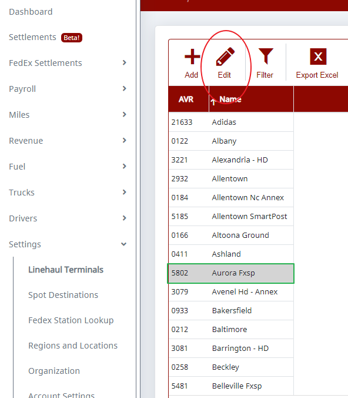
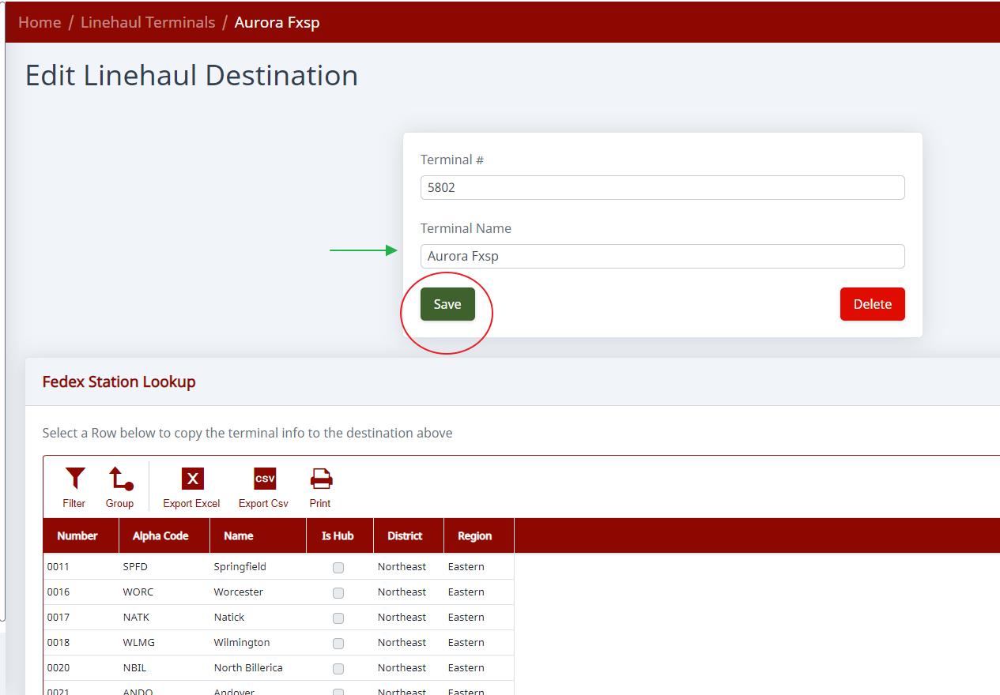

# How To Rename Butt Head Locations

To rename the Butt Heads / Bumps, go to **Settings** >> **Linehaul Terminals** and find that AVR number in the list (the system should auto-add it the first time it is seen on a settlement).

Double-click the one you'd like to edit and it will take you to a screen where you can enter the name as you'd like it displayed, then click **Save**.

> **Note:** We haven't been able to get a list of Butt Head locations from FedEx, so we're not able to pre-populate them in the system.

