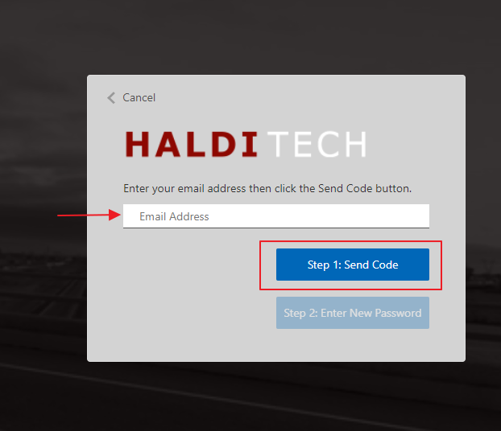
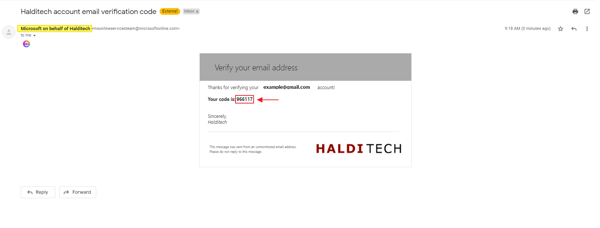
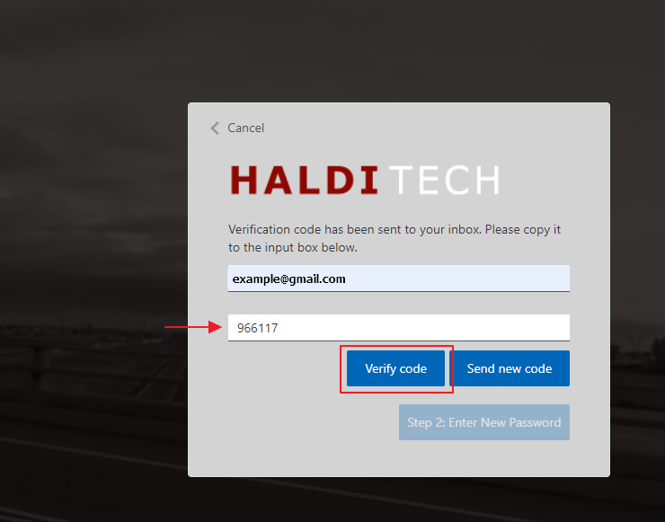
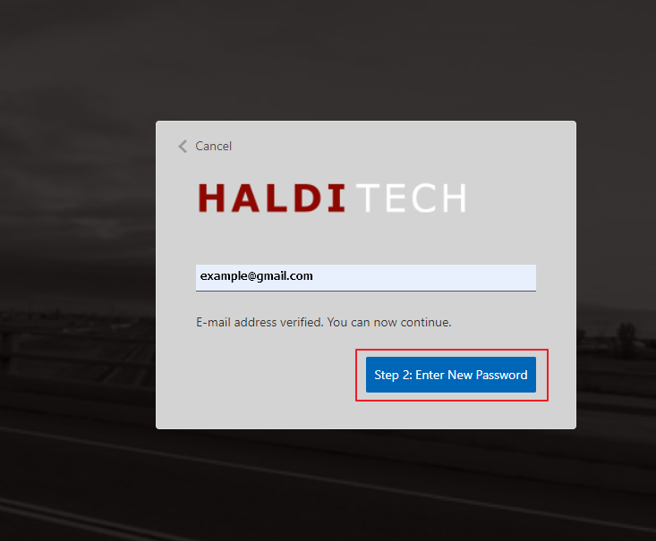
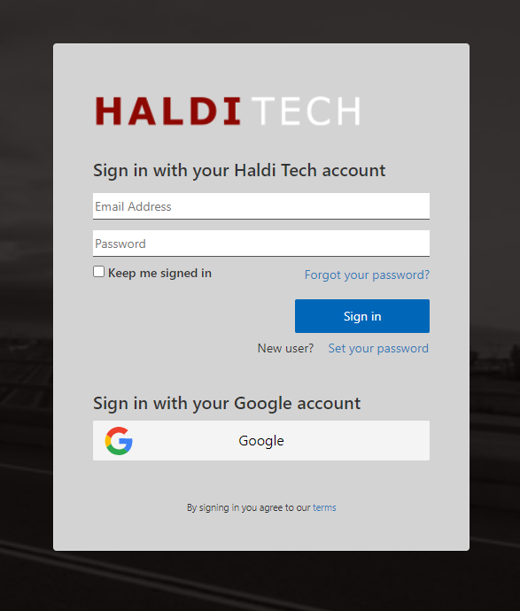

# How to Reset Your Password

To reset your password, go to the login screen and click on "Forgot your password".

> **Note:** If you're trying to reset your password for another user, that user has to initiate the password reset using these instructions. Passwords cannot be reset from within the Haldi FCS app.

## Step 1. Send the code.

Enter the email address used to sign into your account and click on Step 1: Send Code.

## Step 2. Get the verification code.

Check your email for a message from "Microsoft on behalf of Halditech". You'll receive a 6-digit code you will need to verify your email.

## Step 3. Verify the code.

Go back to the Halditech login screen and enter your email and the 6-digit code. Click "Verify Code".

## Step 4. Enter your new password.

Now that your email has been verified, click on Step 2 to enter your new password.

## Step 5. Log in.

After you enter your new password, you will be taken back to the login screen. Enter your email and your new password to log in.

