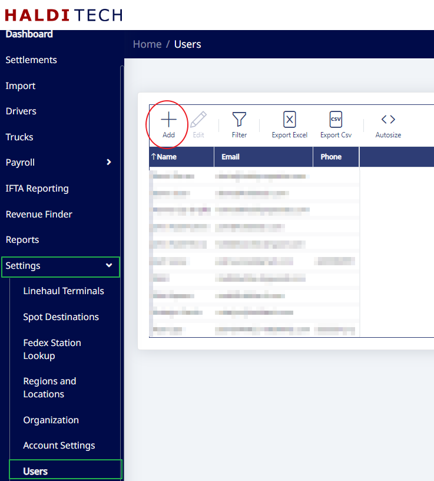
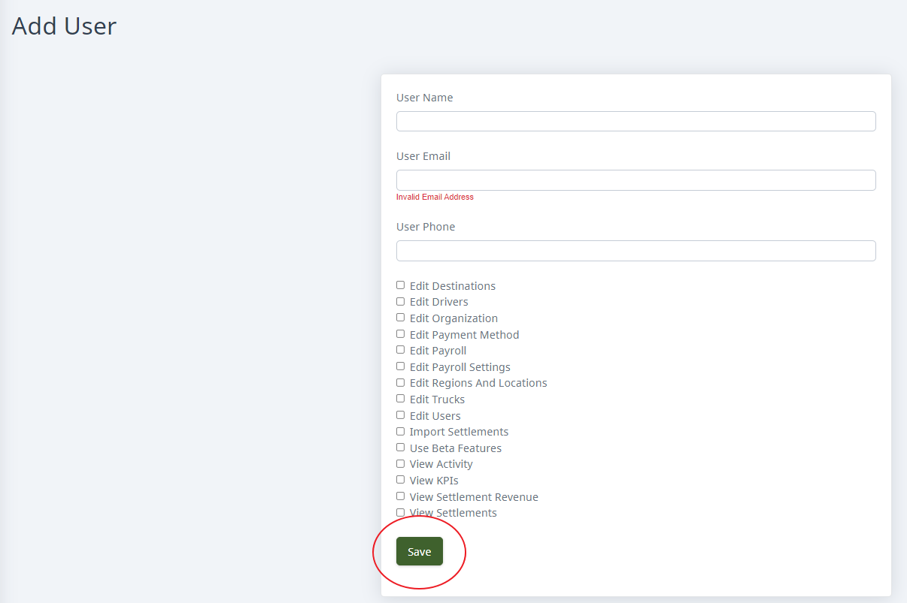

## Add the user

Sign in to your HaldiTech account.

Go to **Settings > Users > Add**.

Add the user's name, email, and phone number. Select the permissions you wish to grant them, and save.

## Have the user set their password

The new user will have to go to [fcs.halditech.com](http://fcs.halditech.com/), click **Set Your Password**, and follow the steps.

