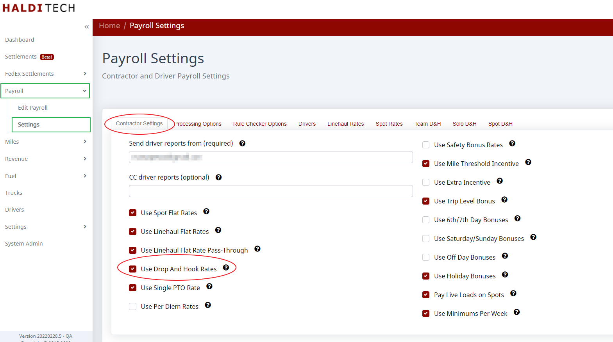
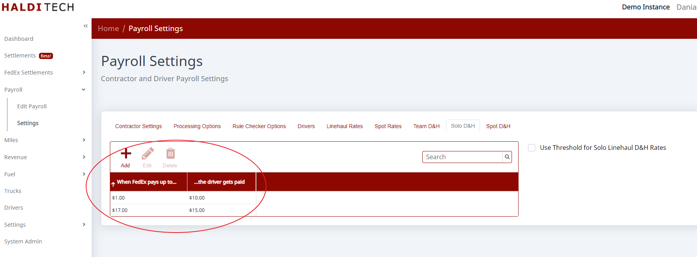

# How To Set Up D & H Rates for Drivers

There are three steps to setting up D&H for your drivers.

## Step 1. Turn D&H rates on

Turn D&H rates on in the payroll settings screen.

## Step 2. Add the rate rules

Add the rate rules. Entering that value as $1 causes the rule to trigger for any D&H payment made by FedEx. If you wanted to pay more for higher FedEx payments, you could add a second row — something like "When FedEx pays at least $17, the driver gets paid $15."

## Step 3. Optionally use a threshold

You can use the **Use Threshold...** option to pay D&H on only shorter trips, where D&H is a bigger percentage of the total compensation for the trip.
