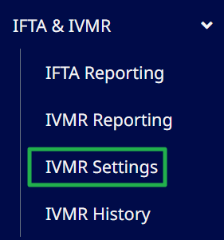
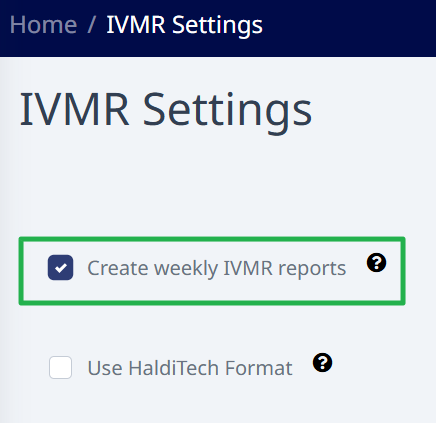
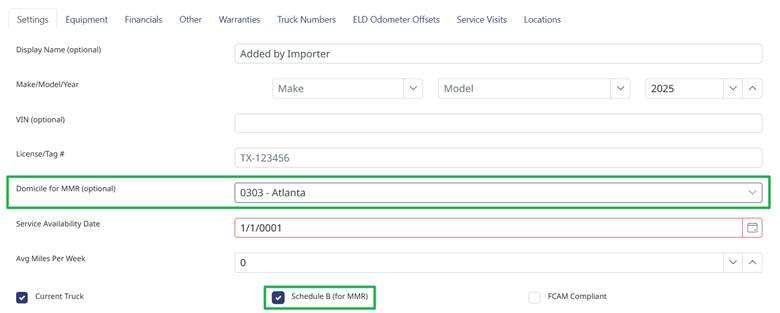
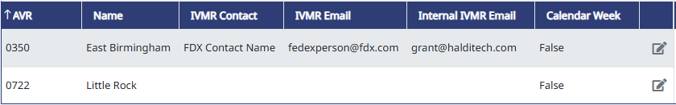

# How to Use IVMRs

Please make sure to read all of these instructions carefully.

> **Important:** The odometer values on your old IVMRs may not exactly match your Haldi Tech IVMRs. This means you can't generate Haldi Tech IVMRs and expect them to match your current IVMR provider's exactly. When you are ready to switch, there is one-time work that needs to be done to get your old IVMRs to match your first Haldi Tech ones. Our support team will help you through that process.

## Step 1. Connect your ELD

For Motive, [click here for instructions](/support/motive-integration-connect-to-motive).

For Trimble, email us at [support@halditech.com](mailto:support@halditech.com) and we'll send you Trimble's data sharing agreement. Once you sign and return the DSA, we'll connect your account.

For Omnitracs, reach out to your Solera Account Manager (could be a 3rd party), and tell them you want to integrate with Halditech and need a Data Sharing Agreement. Once you get the DSA from your Solera rep, sign it and return it to them. You may need to follow up with your Account Manager frequently until they let us know it's been set up.

## Step 2. Wait until a full IVMR period of data has been received.

It generally takes a full week of being connected to the ELD before there is sufficient data to create IVMRs.

## Step 3. Go to IFTA & IVMR, then IVMR Settings

## Step 4. Check the box next to "Create Weekly IVMR Reports". If you want the IVMRs on the FedEx IVMR Form, leave the second box unchecked.

## Step 5. Go into each truck's profile. Make sure the correct Domicile is selected and the Schedule B box is checked.

> **Important:** If either of these are not set correctly, an IVMR will not be created for that truck.

## Step 6. Go to IFTA & IVMR > IVMR Settings and enter the Name and Email address(es) for each terminal you need to submit IVMRs to.

Multiple email addresses can be entered separated by a comma. If you want to receive a copy, put your email address in the Internal IVMR Email field.

You must enter info into each of the 3 fields: IVMR Contact, IVMR Email, and Internal IVMR Email.

> **Note:** If you do not see one of your domiciles in the list, it means no truck has that domicile selected.

## Step 7. Pick a date to start using Haldi Tech IVMRs.

Once you've submitted your final IVMRs from your old provider, forward those IVMRs to [support@halditech.com](mailto:support@halditech.com), and we'll configure your trucks so that the odometers on your first set of Halditech IVMRs will match exactly for a seamless transition.

> **Important:** If you continue to submit your IVMRs outside of Halditech, the odometer values will need to be updated before the first time you use Halditech for your IVMRs.

If everything is configured correctly, your IVMRs will auto-generate and send to the terminal every Monday morning around noon. At the end of each quarter, it will send one batch of IVMRs to the terminal up to the last day of the month. The next set will begin on the first day of the new month or quarter.

If there are any issues with IVMRs or you need help configuring your account, email [support@halditech.com](mailto:support@halditech.com).
