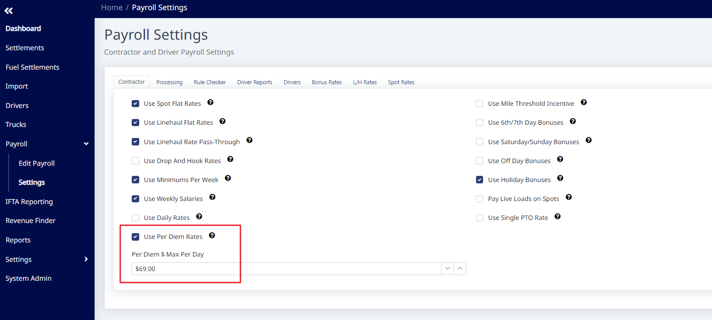
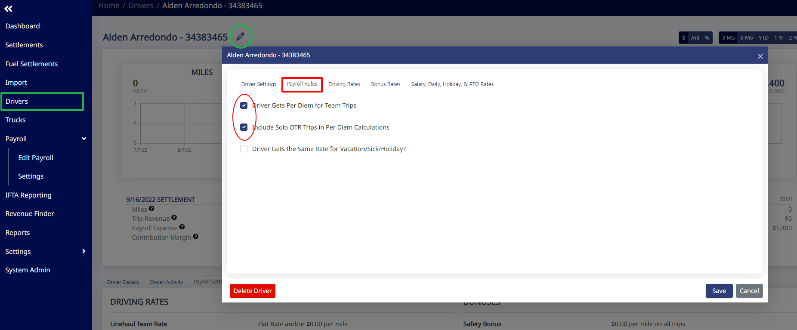
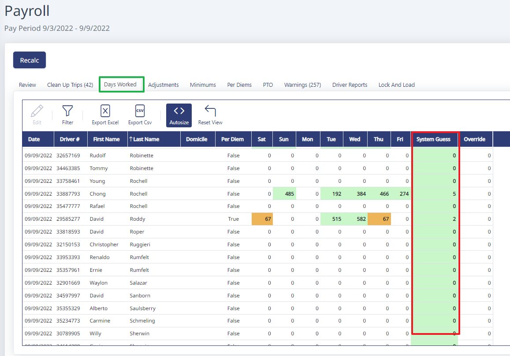
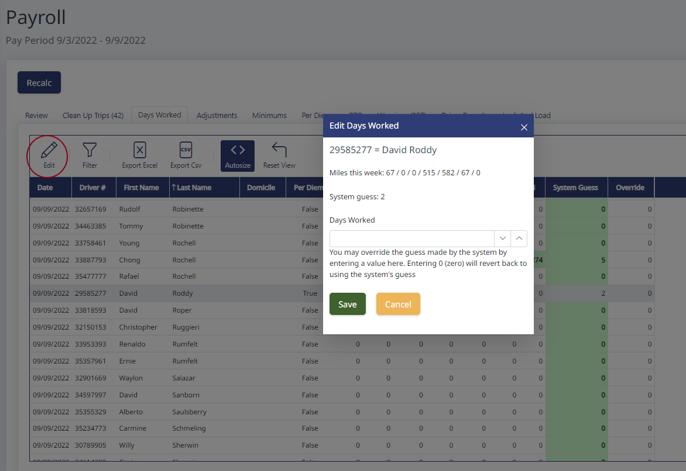

Here is how we look at per diems. If you haven't read it yet, start here: [Per Diems](/support/per-diems).

## Step 1. Turn on per diem rates

Go to **Payroll > Settings**. Turn on **Use Per Diem Rates** and enter the amount you pay for per diem in the box that appears.

## Step 2. Enable solo OTR per diem on the driver

Go to a driver's profile and check the box next to **Driver Gets Per Diem for Team Trips**. When you turn this on, a new option appears that says **Include Solo OTR Trips in Per Diem Calculations** — turn that box on too. This applies the per diem to ALL solo trips for that driver.

## Step 3. Verify or override days worked each week

Each week, go to the **Days Worked** tab in payroll. The **System Guess** column shows how many days of per diem a driver will get. If the number of days doesn't match (for example, a driver drove 5 days but only had 3 nights OTR), override the system guess with the correct number of per diem days.

To override, highlight the driver's name, click **Edit**, and enter the days worked.

