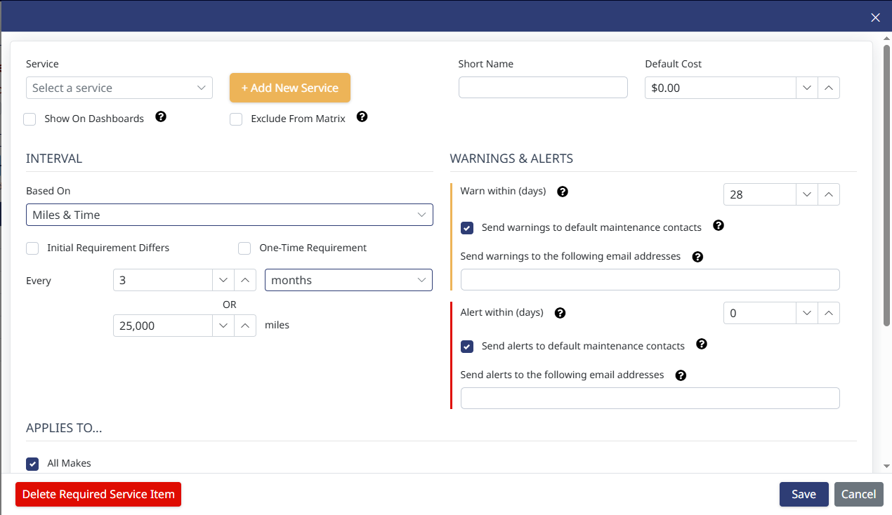
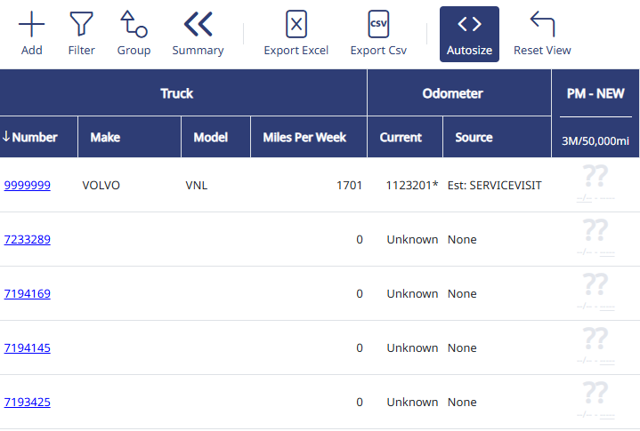
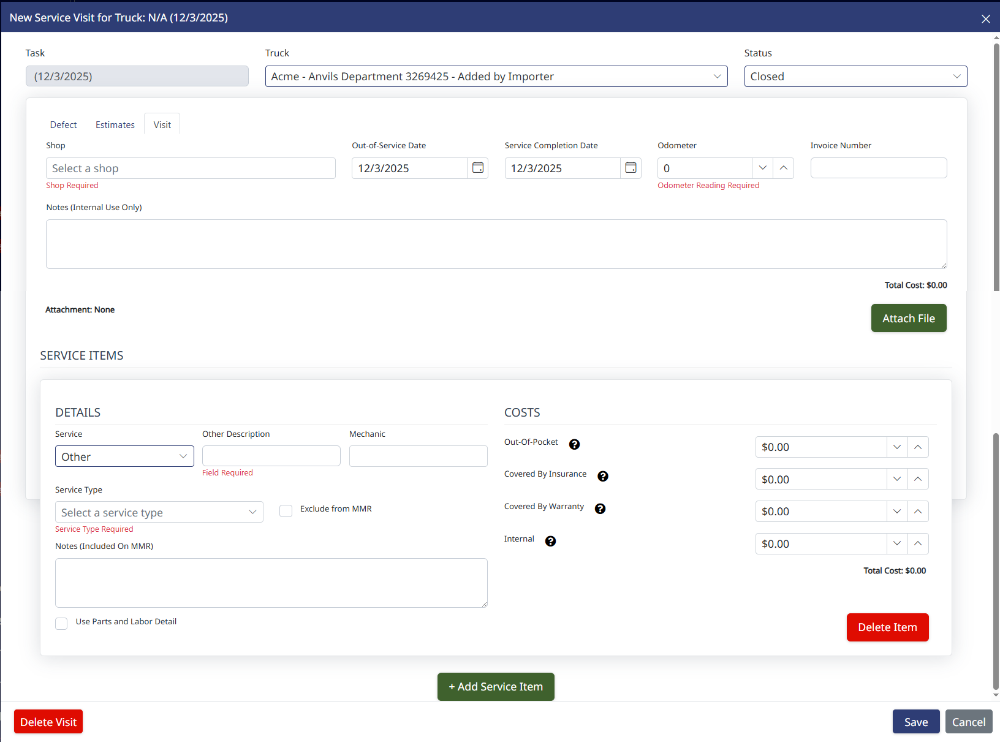
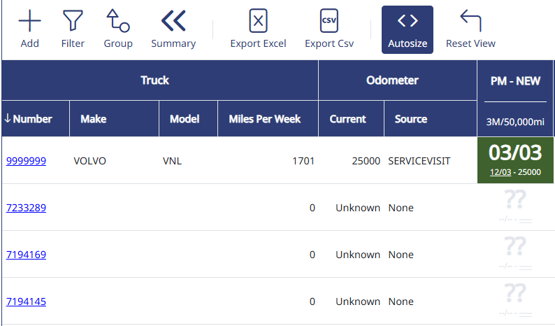

## How to Track Required Maintenance

Setting up maintenance requirements and using the Maintenance Matrix.

## Step 1. Create the maintenance services you want to track

Go to "Maintenance" > "Requirements", then click "Add".

In the box that comes up, click "Add New Service" and enter the name of the service you want to track. For example, you can add things like PM, Oil Change, Annual Inspection, Overhead, etc.

Then, select the maintenance interval. You can base it on miles, time, or both.

If you want emailed alerts when the service is nearing its due date, enter email addresses into the Warnings and Alerts box.

Click "Save".

## Step 2. View the requirement in the Maintenance Matrix

You can now see the requirement you just created by going to "Maintenance" > "Maintenance Matrix".

The matrix will have a column for each requirement you create. Initially, you'll see white boxes with "??" like the screenshot below. This means we can't estimate when the next service is due because we don't know when the last one was completed.

## Step 3. Enter completed work

To enter work completed, go to "Maintenance" > "Service Items", then click Add. This is where you enter work that was done on a truck that came in on a single invoice.

- **Truck:** Select the truck.
- **Shop:** Enter a shop name.
- **Service Completion Date:** Enter the date the work was completed.
- **Odometer:** If you have an ELD integration, it will auto-populate the odometer value for the service completion date. If we can't get an odometer from the ELD, you'll need to enter it manually.
- **Attach File:** You can upload a copy of the PDF invoice (for inclusion with your MMRs), if you choose.
- **Service:** Select what service was done. If more than one service was performed, click the green "Add Service Item" at the bottom to create another section.
- **Service Type:** Choose between scheduled, unscheduled, and damage/accident.
- **Notes (Included on MMR):** Enter what you want it to show on MMR. Don't forget to start with an action word.

Click "Save".

## Step 4. Return to the Maintenance Matrix

Go back to the Maintenance Matrix. Now you'll see the white box with the "??" has turned green and shows the estimated date that the next service is due. When the truck gets within 30 days of that service coming due, the square will turn yellow. If it is past due, it will turn red.

Any time a truck has service work, go into "Service Items" and record what work was done.

**Need Help?** [support@halditech.com](mailto:support@halditech.com) or call us at 470-594-2534
