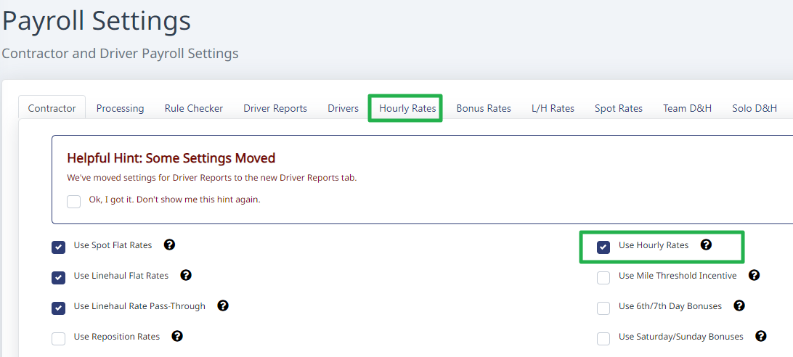
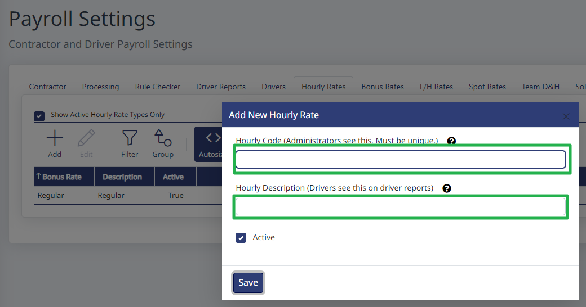
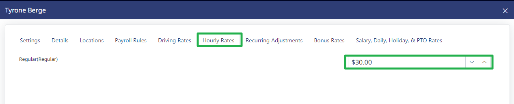
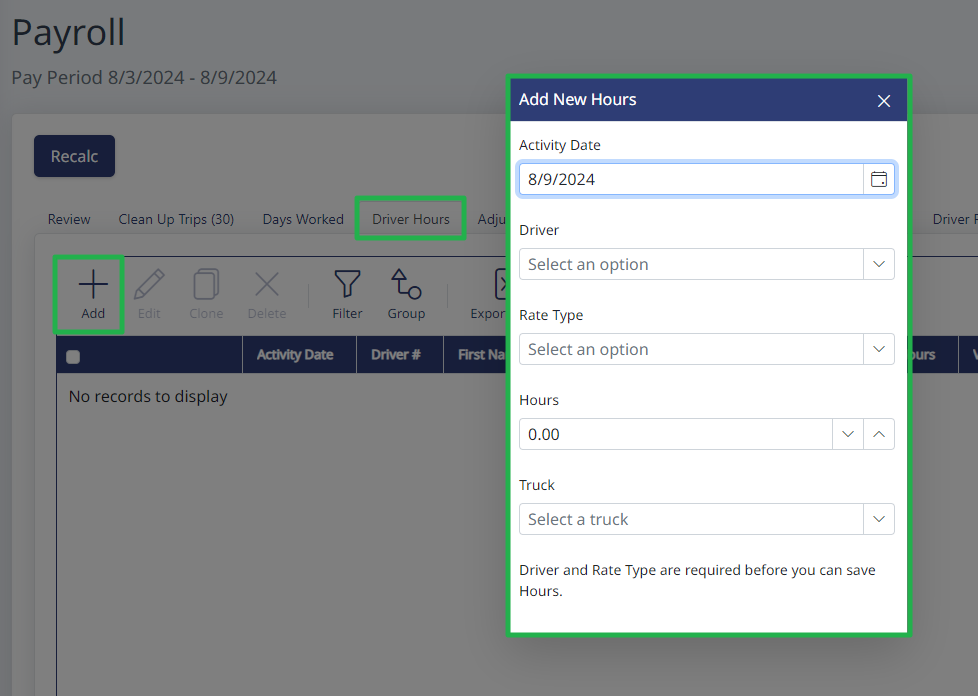

Go to Payroll > Settings.

Check the box next to "Use Hourly Rates". A new tab will appear at the top called "Hourly Rates".

On the Hourly Rates tab, click "Add", then add a name for the rate you want to create. For example, you could add one rate called "Regular" and one called "Overtime".

Now that you've created a rate, go into each driver's profile to the "Hourly Rate" tab, and add the rate for that driver.

Once the drivers' rates are set up, in Payroll, go to the "Driver Hours" tab, and click "add". Select the driver, the number of hours, and which rate type you want to apply.

