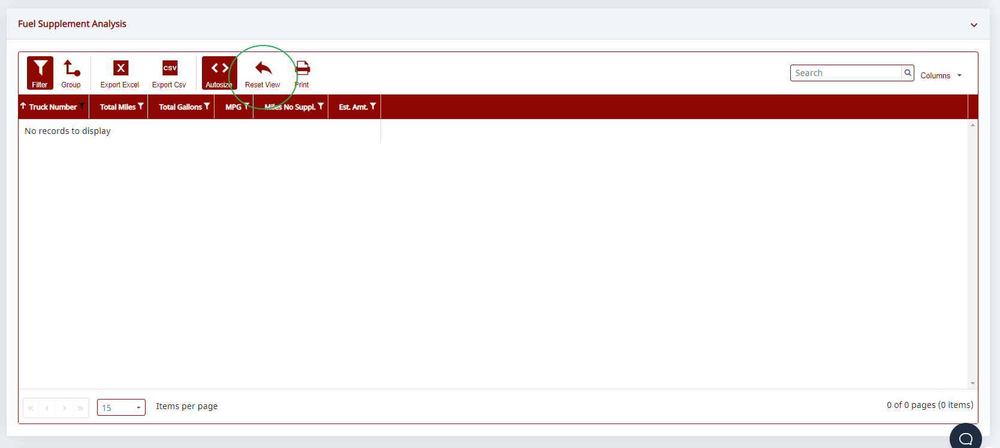
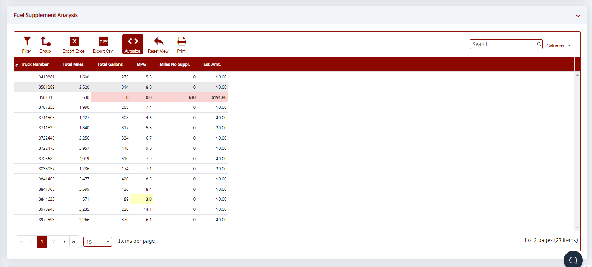

# How to Use the Reset View Button

When viewing any grid, if you are missing rows or data, it's likely because the software remembered your configuration from the last time you used the system.

To fix this, push the **Reset View** button. It will restore the grid to the default view (i.e., clear all filters, searches, hide/reveal columns, and restore default column widths).

Here's a sample screen showing missing data.

Here's the same grid once the view has been reset.

