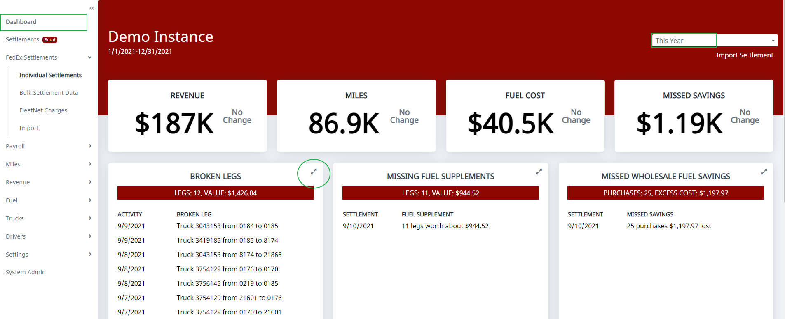
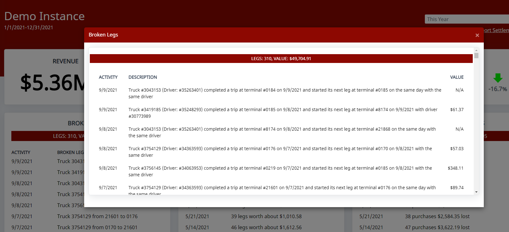

There isn't currently a way to view the broken leg reports over multiple settlements. You either have to pull up the individual settlements, or, on the dashboard, select **This Year** and click the two arrows in the top-right corner to show a list. That view isn't easily exportable at this time.

