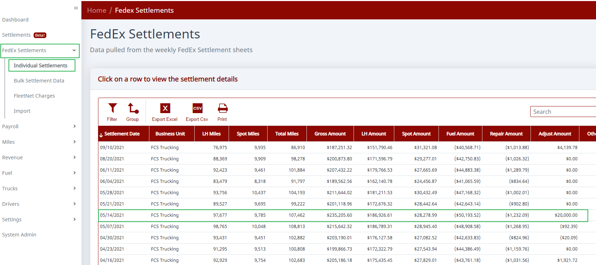
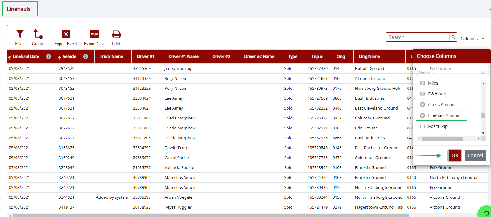

# How to View Net Revenue After Fuel

## Step 1. Open an individual settlement.

Go to FedEx Settlements >> Individual Settlements. Click on the settlement you want to work on. The settlement will expand and you will see a breakdown of that settlement.

## Step 2. Turn on the Linehaul Amount column.

Scroll down to Linehaul, then turn on the "Linehaul Amount" column.

