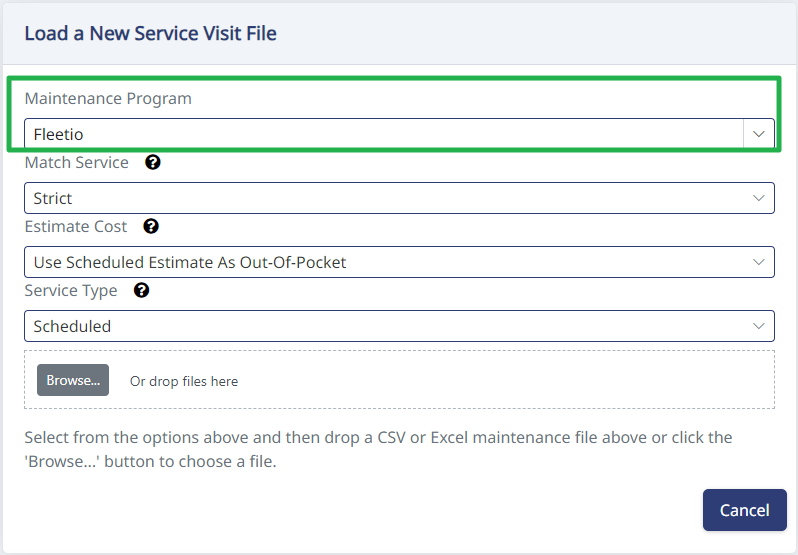

All of your Fleetio maintenance history can be imported into HaldiTech. HaldiTech can then be the source of your maintenance and service history, including reminding you when PMs are needed, tires need rotating, and so on.

## Import your Fleetio file

To import your Fleetio file into HaldiTech, go to **Maintenance** on the left, then **Service Items**. At the top of the table, click **Import Excel**.

Then choose either **Fleetio** or **Fleetio Extended** from the dropdown, depending on your file. Drag and drop the file and click **Save**.

## Fleetio format — required columns

For **Fleetio**, the import looks for the following columns in the file:

- Vehicle
- Service Entry
- Completion Date
- Reference
- Vendor
- Notes
- Primary Meter
- Primary Meter Unit
- Service Tasks
- Total Cost

## Fleetio Extended format — required columns

For **Fleetio Extended**, the import looks for the following columns in the file:

- Fleetio ID
- Vehicle Name
- Watchers
- Operator First Name
- Operator Last Name
- Repair Priority Class
- Meter
- Meter Unit
- Secondary Meter
- Secondary Meter Unit
- Service Tasks
- Issues
- Vendor Name
- Labels
- External ID
- Reference
- Created By First Name
- Created By Last Name
- Started At
- Completed At
- Duration (Days)
- Notes
- Labor Subtotal (USD)
- Parts Subtotal (USD)
- Subtotal (USD)
- Tax (USD)
- Discount (USD)
- Total Cost (USD)
- Crated On
- Updated On
- Vehicle Group
- Vehicle Year
- Vehicle Make
- Vehicle Model
- Vehicle Trim
- Vehicle Type
- Vehicle Status
- Vehicle VIN/SN

