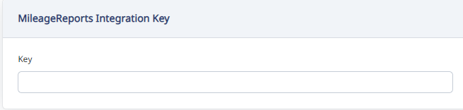

To get the integration key:

1. Go to profile in MileageReports (user icon top right of the page).

   > _[screenshot to be recaptured]_

2. On the profile page there is a Secret Key. Copy it.

   > _[screenshot to be recaptured]_

3. In Haldi Tech, paste the key (Settings > Account Settings > Integrations).

   
