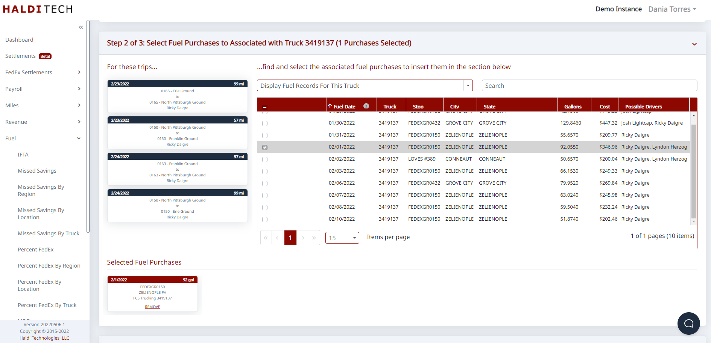
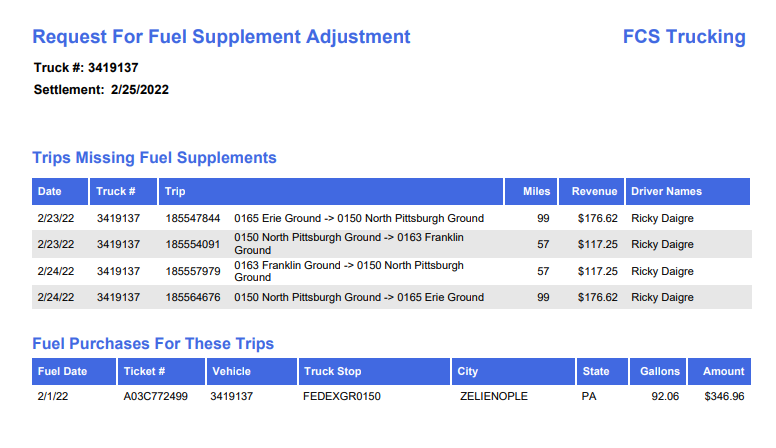

# Missing Fuel Supplements

## Why are fuel supplements missing from your FedEx settlement?

This can occur for one of two reasons.

**Reason 1: Card / truck-number mismatch.**

- The TChek card that was used to purchase fuel didn't match the FedEx truck number it was registered with.

**Why does this happen exactly?** This can happen if a driver took a card from one truck and used it in another, or if FedEx changed the truck number on you.

**Reason 2: The truck wasn't fueled recently.**

- The truck with the missing fuel supplement wasn't fueled in the settlement week or in the previous week. Usually, this is a spare-truck scenario where you haven't used a truck for a while and then make some runs without fueling it. (FedEx only looks back at one settlement, so this is more than likely if the truck was out for more than a week or so.)

## What should you do?

In either case, you'll need to supply your FedEx Terminal Manager (where the truck is domiciled) with a request for adjustment. Include the following on the request:

1. The FedEx truck number.
2. The trips for that truck from the settlement. Include the trip numbers, destinations, dates, etc.
3. The corresponding fuel purchase ticket numbers related to the fuel used by that truck for those trips. Those could be associated with the wrong truck if you've got a card mismatch, or they could be on older settlements if the truck was a spare or didn't fuel up recently.

## In Revenue Finder

1. Select the truck with Missing Fuel Supplements.
2. Scroll down and search for and select the Associated Fuel Purchases. You can use the drop-down to help you find likely purchases. For example, choose a truck from a recent settlement and pick the 'Display Fuel Records For This Truck' option.
3. Scroll to the next section. Insert a note in the 'Shared Notes' field. This is what the terminal manager will see on the report.
4. Click Download Report and you'll get something like the report below.

