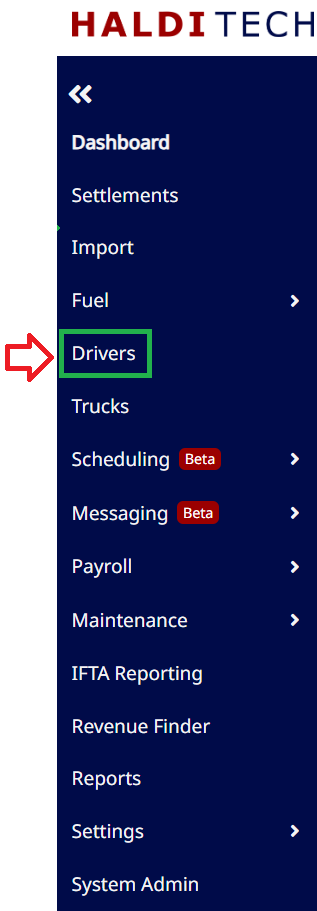
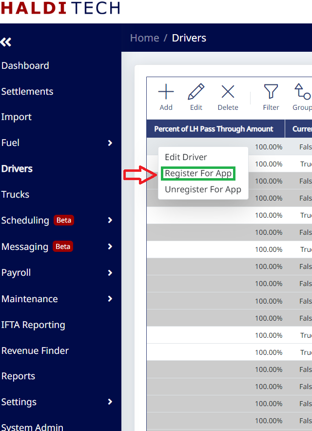
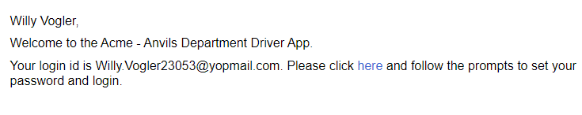
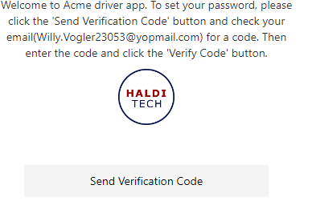
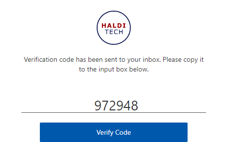
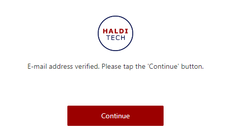
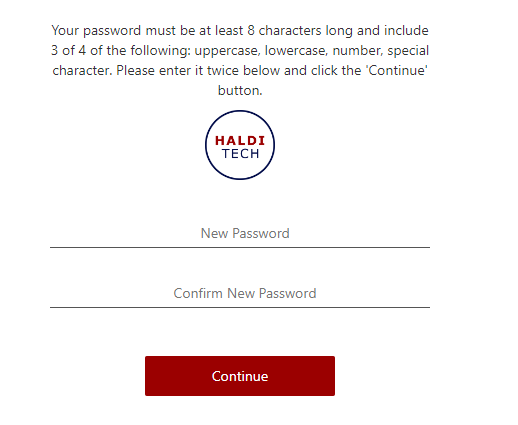

# Mobile App Integration For Driver

## Register Your Driver

- In your HaldiTech dashboard, click on the driver icon (as shown below).

- In your HaldiTech Driver tab, right click on the driver, and click Register For App (as shown below).

## Creating your login and password

- You will receive an email with your user name and a link to create a password (as shown below).

- After opening the link, click "Send Verification Code" to create your password (as shown below).

- Enter the verification code and click "Verify Code" (as shown below).

- Your email is now verified and you may click Continue (as shown below).

- You will now be prompted to create a password (as shown below).

