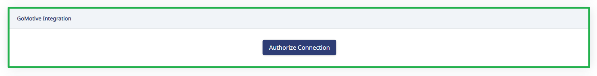
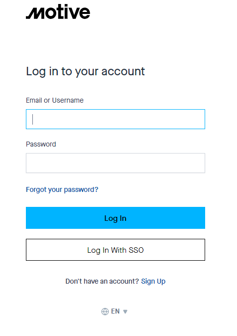

# Set up your Motive Integration

> **Important:** If you access more than one company or business unit in Motive using the same Motive credentials, you'll need to create separate Motive users for each company and business unit. Give each of those new Motive users access to only one Motive company/business unit. Then repeat steps 1 through 5 below, using a new incognito browser each time and linking HaldiTech business units to the corresponding Motive companies and business units, using the appropriate Motive user credentials.

## Step 1. Open HaldiTech in an Incognito Browser window.

## Step 2. Authorize the connection.

Go to "Settings", then "Account Settings". Click on the "Integrations" tab. Scroll down to "GoMotive Integration", then click "Authorize Connection".

## Step 3. Connect if already logged in.

If you are already logged into your Motive account, it will connect once you push "Authorize Connect".

## Step 4. Log in if prompted.

If you aren't already logged in, it will prompt you to enter your Motive login credentials.

## Step 5. Confirm the integration is working.

That's it. We'll automatically start pulling your Motive data into your HaldiTech account. You can check the integration is working by going to "Maintenance", then "Odometers". You should see "GoMotive" in the source column (it can take a few minutes after you set up the integration for the odometers to update).

**Need Help?** [support@halditech.com](mailto:support@halditech.com) or call us at 470-594-2534.
