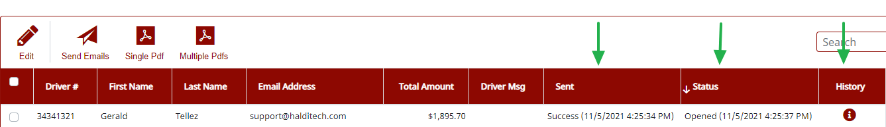
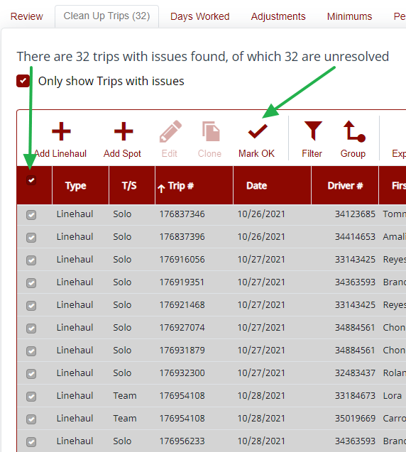
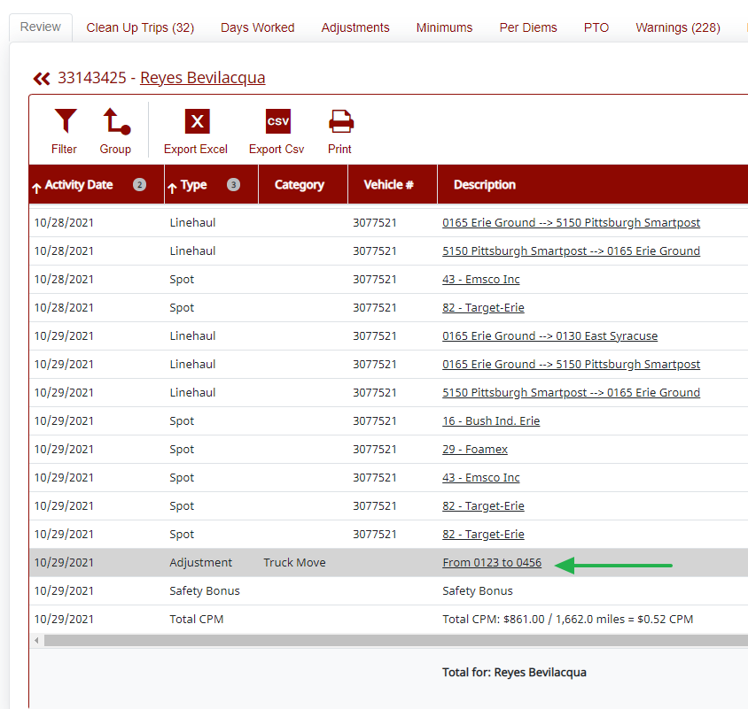
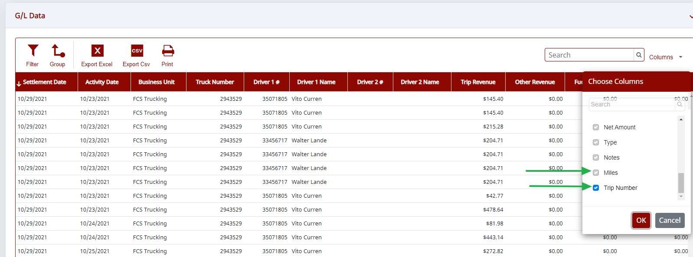

# Version 20211105.1 is Live!

Here are the newest features in Haldi FCS. If you have questions, or want us to walk you through how to use any of these new features, let us know.

## Highlights of New Features

1. **Payroll** — Driver Report Email Status Tracker
2. **Drivers** — New Driver Profile Field: Driver Domicile
3. **Account Settings** — Change Your Subscription
4. **Payroll** — Bulk Update "Mark as Ok" in Payroll
5. **Payroll** — Modify Payroll Adjustments from Driver Review Screen

## What's New in Payroll

1. Track the status of driver reports from the **Driver Report** tab. The **Sent** column will display a success or failure message. The **Status** column will indicate if it has been delivered or opened by the driver. Clicking on the icon in the **History** column will give detailed info on all attempts to send, especially if the same driver report was emailed more than once. Statuses will auto-update, and can be manually updated by clicking the **Recalc** button.

2. Select multiple rows in Clean Up Trips and "Mark as OK" in bulk.

3. Modify adjustments by clicking directly in the driver's summary on the **Driver Review** tab.

4. Added a new check in warnings that will flag any instance of a driver receiving a minimum but not being eligible for a minimum.

## What's New in Drivers

1. A new **Domicile** field has been added to the driver profile. Turn this column on in payroll to sort drivers by domicile.
2. Toggle between a summary and detailed view in the driver grid. Clicking the **Details** button will display all driver details in the grid. Clicking the **Summary** button will return to the summary view.

## What Else is New

Users with payment information permissions can now change subscription levels by going to **Settings > Account Settings**, then the **Subscription** tab.

The G/L Data grid in Individual Settlements has two new columns, **Trip #** and **Miles**. To view these columns, use the column chooser to turn them on.

## Resolved Issues

- **Driver Reports** — The extra incentive line will no longer appear if extra incentive is zero.
- **Payroll** — The loading issue on the driver review tab has been fixed.
- **Payroll Settings** — Adding an improperly formatted email address to the CC field will generate a warning.
- **Payroll** — Sorting issue in Clean Up Trips has been resolved.
- **Dashboard** — For contractors with multiple business units, the new drivers, new trucks, and new locations boxes now display the business unit name.
- **Settlements** — The fuel grid now displays a total for the "missed savings" column.
