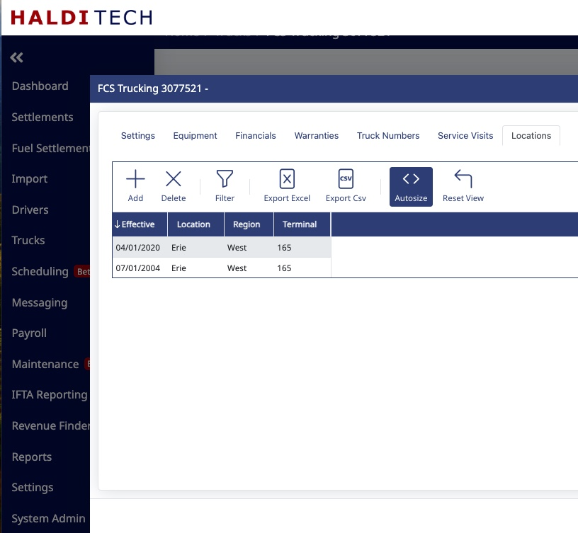
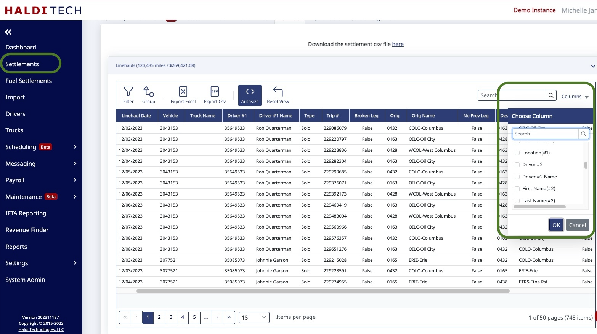

Regions and Locations is a feature designed to enrich your data with truck-level specifics for where a truck is located. This lets you "bucket" your data to match how you divide up your operations. It was requested by a number of customers who wanted the ability to bucket their data according to where a truck lives within their operation.

We use the terms Regions and Locations because that's how most contractors use the feature, but you could also think of them as Category and Subcategory. There's really no limit on what you can put into the fields, and hence no limit on how you might want to organize your data.

## Creating / editing Regions and Locations

You can edit your defined regions and locations from the settings menu, in the **Regions and Locations** submenu:

> _[screenshot to be recaptured]_

Begin by defining the higher-level Regions, and below each define the Locations that belong to a Region. Here's an example using our demo data:

> _[screenshot to be recaptured]_

## Adding a Region / Location to a truck

Once you've defined your Regions and Locations, edit each truck: go to **Trucks** on the left-hand menu, click on the truck you would like to edit, select the **Edit** button on the toolbar, then the pencil next to your truck number.

> _[screenshot to be recaptured]_

Select the **Location** tab, then select the **Add** or **Delete** button to edit the Regions and Locations for the truck. In this example, you could say that a truck was in Erie on April 1st, then again on July 1st.

## Reporting on Regions / Locations

When pulling reports on your miles, revenue, etc., you can drill those reports down by Region and Location. That gives you a picture of how many miles you drove in each region. If you've got a large fleet with multiple managers, this provides helpful breakdowns of your data, separated by whatever Regions/Locations you've defined.

> _[screenshot to be recaptured]_

## Using Regions / Locations in settlement data

Anywhere the system provides truck-specific information, it shows the vehicle number. The Region/Location for that truck is also folded in by date — you just have to enable those columns. For example, open a settlement and look at Linehauls:

> _[screenshot to be recaptured]_

If you go to the drop-down in the upper-right grid, you'll see additional fields:

The correct Region/Location is attached based on the dates you specify. You can now filter and group that data in the grid using those fields, and export the data to Excel with those fields turned on for further analysis.
