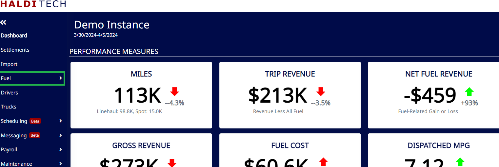
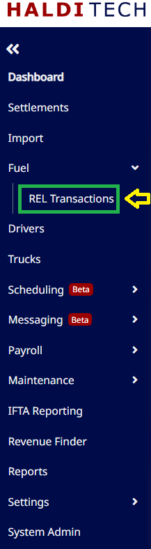
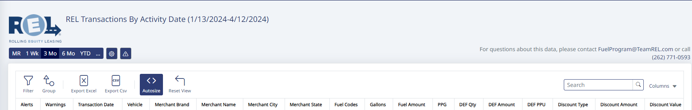
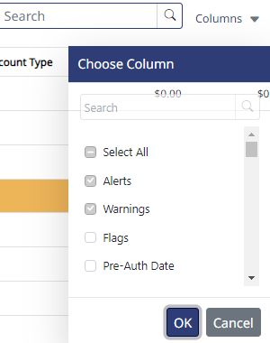
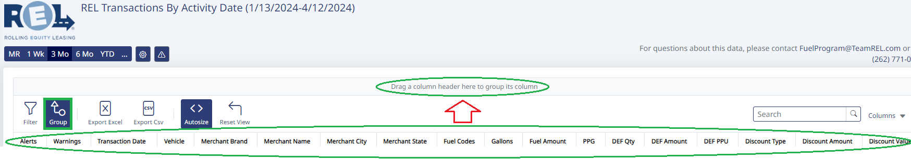
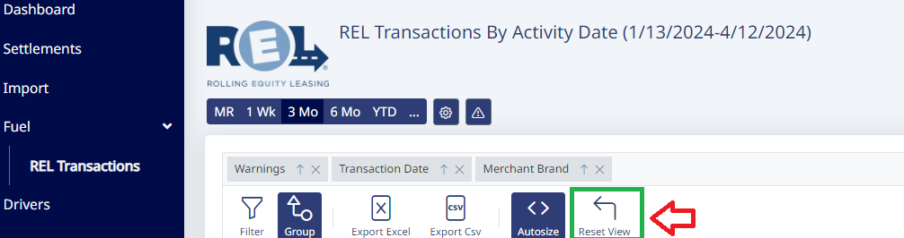
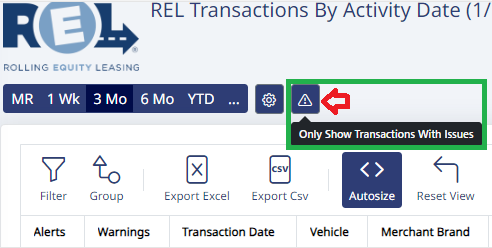
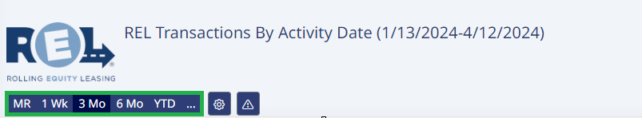
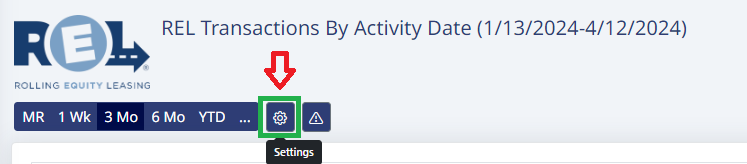
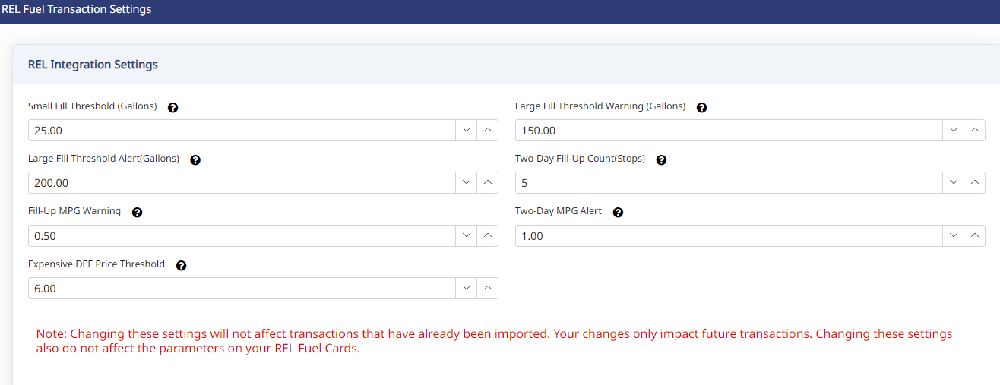

## Getting started

On your HaldiTech dashboard, click on the **Fuel** drop-down on the left-hand side of the page.

Click on the **REL Transactions** tab. This will take you to the Fuel Monitor.

Your REL Fuel Monitor will appear similar to the below:

## Customization

You may add or remove the columns that are relevant to you by clicking the **Columns** drop-down.

You may customize your viewing experience by clicking the **Group** icon. This lets you group columns together by dragging and dropping.

To return to the original view, click **Reset View**.

To view warnings/alerts only, click on the icon shown in the screenshot below. To return to the previous view, simply click on the warning/alert icon again.

> **Note:** When you first activate your REL Fuel Monitor, you will be able to go back 7 days from your most recent fuel file. As time accrues, you will eventually be able to view 3 to 6+ months of fuel transactions.

## Settings

To change your settings for alert/warning parameters, click the gear icon shown below:

The REL integrations setting can be adjusted to reflect what is relevant to your business.

> **Note:** Changes will not take effect until your next fuel settlement is uploaded the next day.

