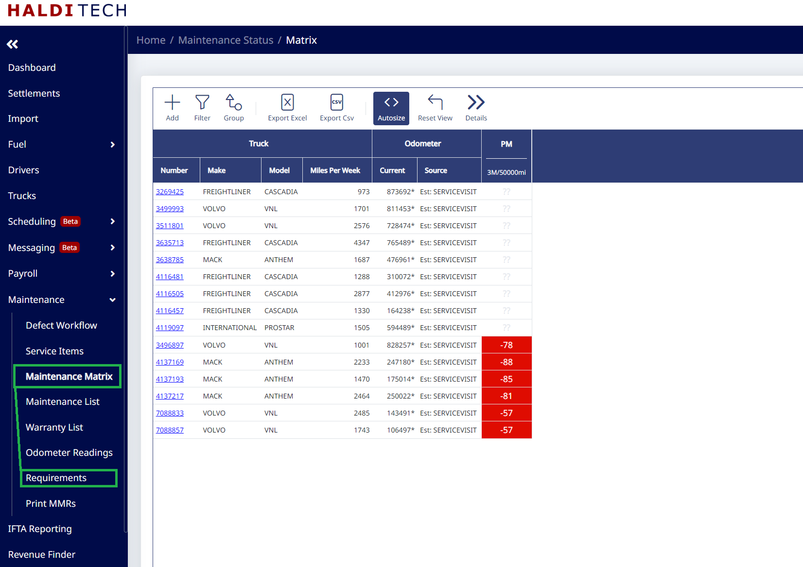
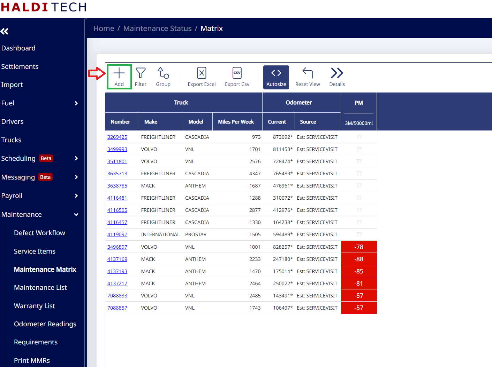
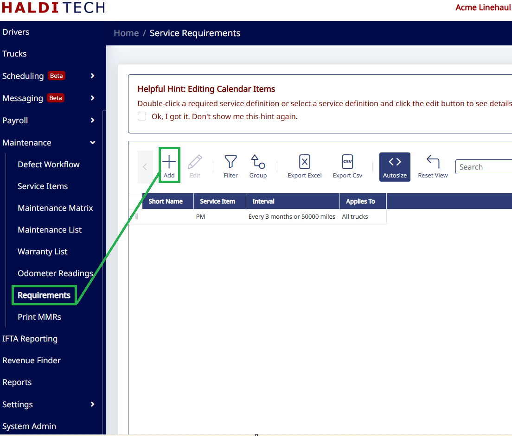
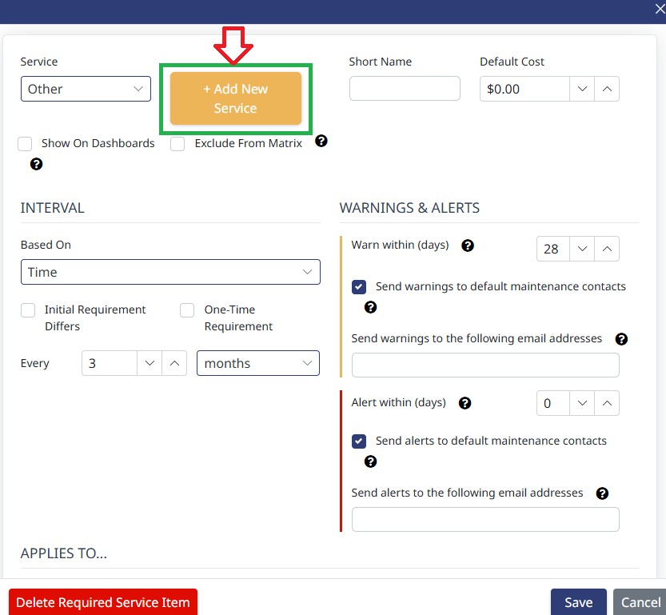
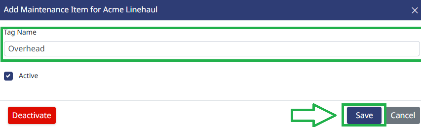
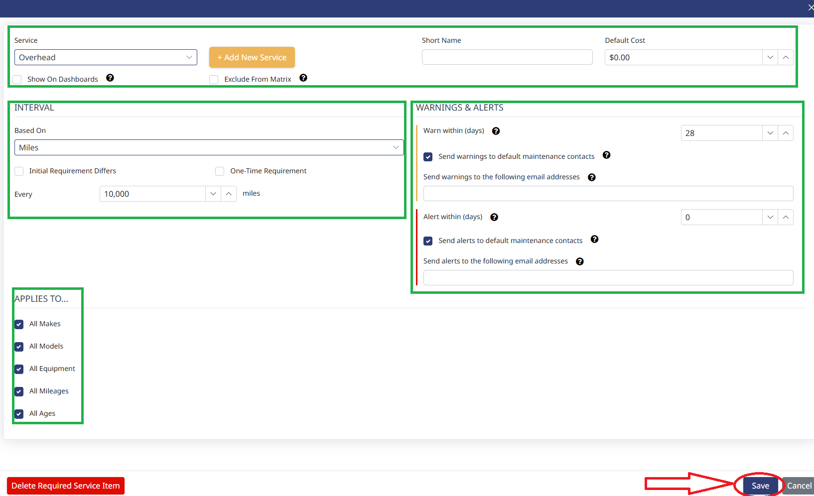
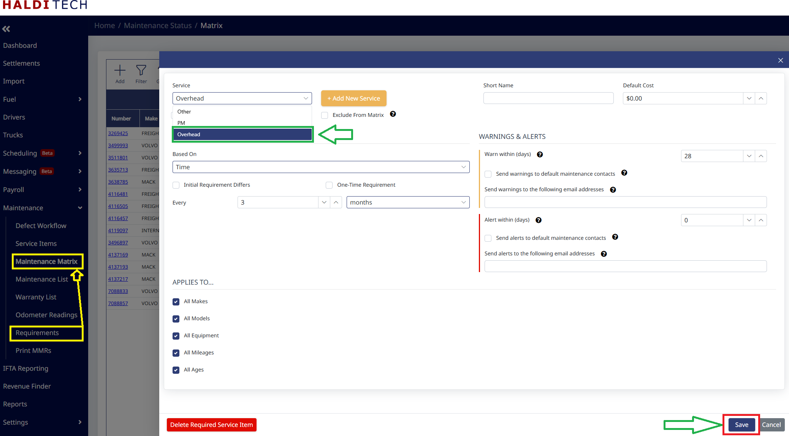
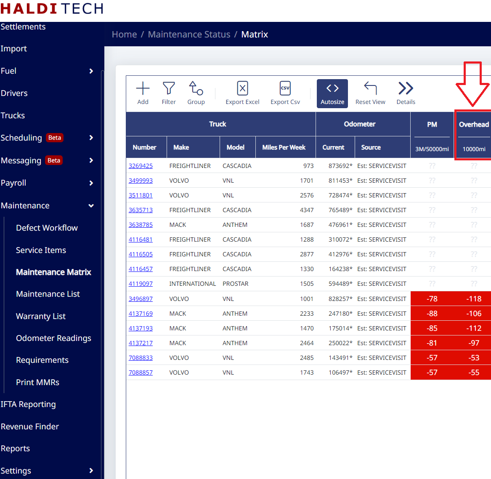

# Requirements

The Requirements tab is an extension of the Maintenance Matrix. You can create any requirement you need in terms of preventative maintenance.

You will be able to add columns by clicking the **Add** icon. This will create a heat map that shows you when the next service for each truck is due. This is based on odometers being pulled through TruckSpy or average miles that come in on your settlement, located in the **Source** column. If you don't have TruckSpy or Mileage Reports, we will pull your odometer reading from the last service visit that was entered for the truck. We then take the odometer that was entered and add the miles that accrued from the settlement since that service visit.

## Adding a service to the Maintenance Matrix

The Maintenance Matrix is populated by going to **Requirements**. You can choose your own custom name for the preventative maintenance (e.g. "PM", "Oil Change", "New Tires", etc.). In **Requirements**, click the **Add** icon (example below).

In the next window, select **Add New Service** (see below).

On the next window, type in the **Tag Name** (name of service) and click **Save** (see below).

You can set the parameters in the boxes highlighted below.

After saving the new service, in the Maintenance Matrix you can see below that "Overhead" has been added.

You will now be able to see the new service added to the Maintenance Matrix (screenshot below).

