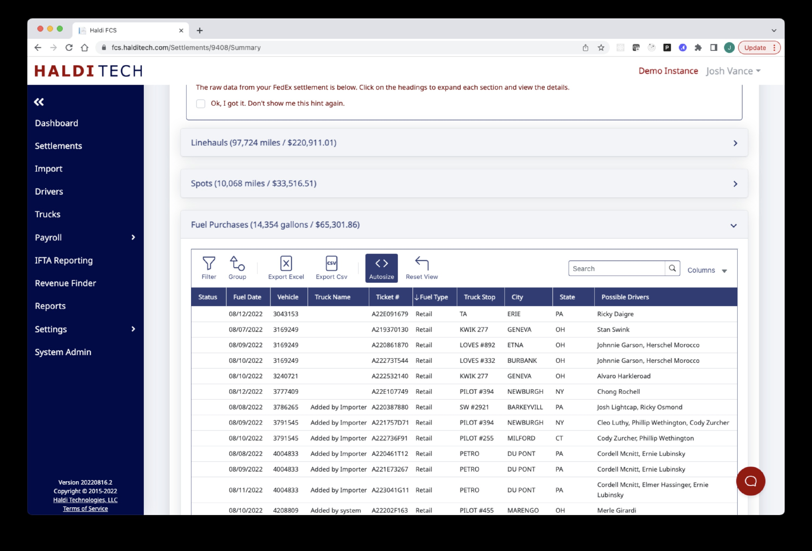
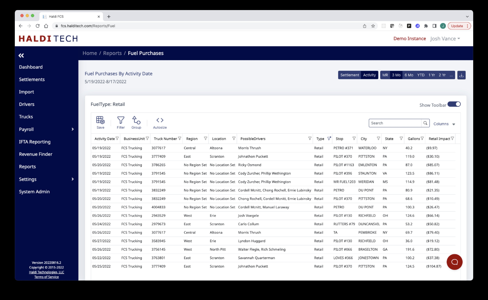
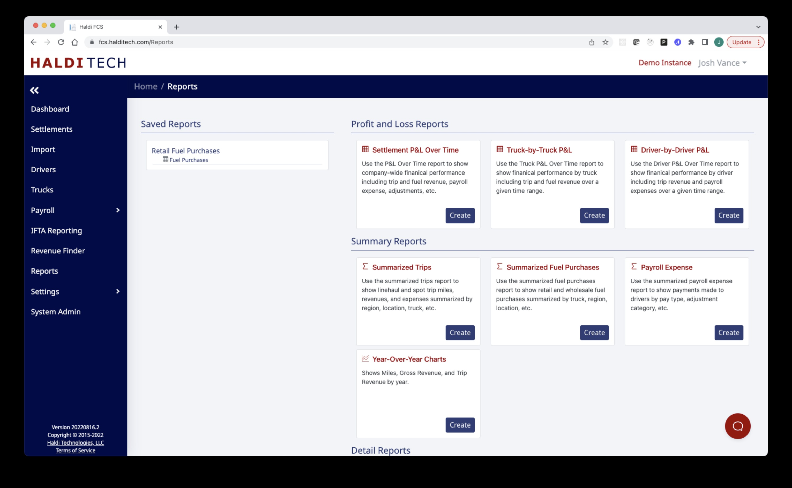

# Retail Fuel Purchases

There are a couple of places to see which drivers "might have" purchased retail fuel. I say "might have" because FedEx doesn't tell us who purchased fuel on the settlements, so we have to guess based on trips around the same time as the purchase.

## Per settlement

On a settlement-by-settlement basis, open the **Settlement** from the Settlements menu, go to the **Raw Data** tab, scroll down and expand **Fuel Purchases**, and sort by fuel type. You'll see something like below:

## Across settlements

If you want to look across settlements, go to the **Reports** menu and scroll down to the **Detail Reports** section. Then click the **Create** button under **Fuel Purchases** and you'll get a report that looks like the image below. You can sort by clicking the **Type** column header, or show the toolbar and filter by type. Change the date range using the buttons at the top right of the screen. The column called **Retail Impact** is "Missed Savings."

If you filter to **Type = Retail** and show only the columns you want using the column chooser, you can click the **Save** button on the toolbar. That saves the report parameters (your filters, date ranges, columns, etc.) and you can call it back up easily from your saved Reports (see second image).

Saved report — see the list on the left. I named the report "Retail Fuel Purchases." I just click on that and it brings up the report as I set it up, without going through the filtering, etc.

