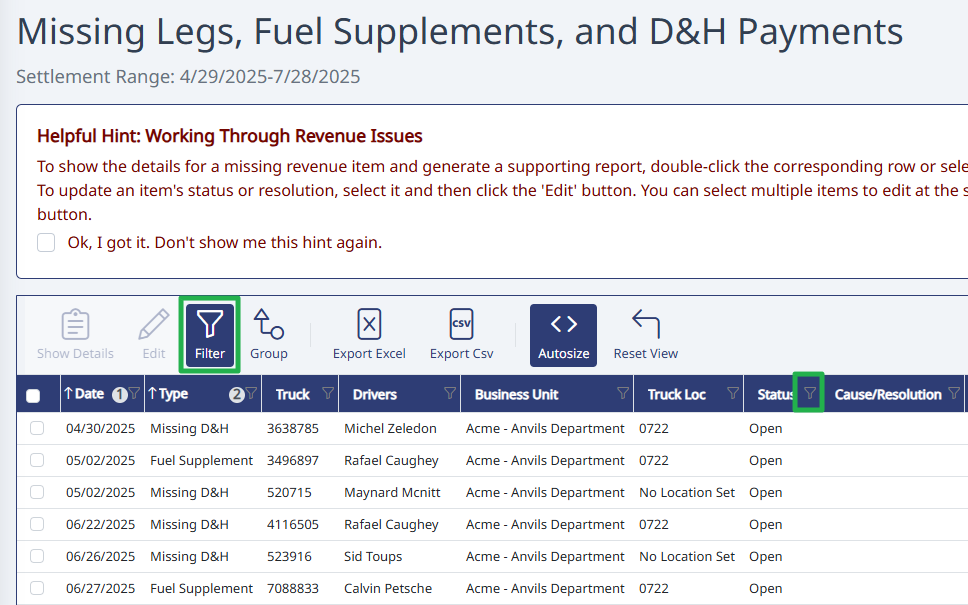
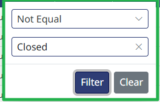

## Using Revenue Finder Filter

Remove closed issues from your view to only see open issues.

## Step 1. Turn on the column filters

To remove closed issues from the view in Revenue Finder, click the "Filter" button in the toolbar. This will cause a small filter icon to appear next to each column. If you don't see the small filter icon, click the "Filter" button in the toolbar once.

## Step 2. Filter out Closed status

Click on the little filter next to the "Status" column. In the box that pops up, choose "Not Equal" from the top dropdown, and type "Closed" into the second box, then click "Filter".

**Need Help?** [support@halditech.com](mailto:support@halditech.com) or call us at 470-594-2534
