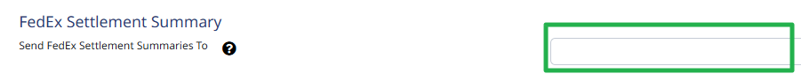
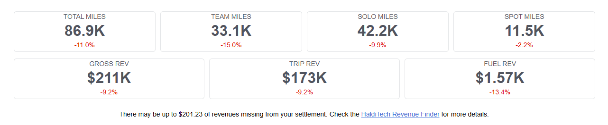

Each week when a settlement is loaded, you can receive an automated Settlement Summary email.

## Turn the emails on or off

Go to **Settings > Account Settings > Notification Settings**. Add one or more email addresses where you'd like the Settlement Summaries sent.

If you have more than one Business Unit, scroll down to add an email address for each company separately.

## What each number in the email means

1. **Total Miles** — The total number of miles on the settlement for the listed Business Unit.
2. **Team Miles** — If you run teams, the total number of miles run when there are two drivers listed on the settlement.
3. **Solo Miles** — If you run solos, the total number of miles run when there is only one driver listed on the settlement.
4. **Spot Miles** — If you run Spots (also sometimes referred to as P&D), the total number of miles to a customer location.
5. **Gross Revenue** — The Total Gross amount from your settlement.
6. **Trip Revenue** — Total revenue generated from operations after taking out any revenue that is intended to cover fuel expense. This is not the same number as Gross less Fuel.
7. **Fuel Revenue** — This number adds all revenue intended to cover fuel (part of your VMR and the Fuel Supplement) and subtracts your actual fuel expense. In a scenario where you're fueling 100% on the FDX yard and your fleet average fuel efficiency is 7.0 mpg for the week, your fuel revenues and fuel expenses would break even. If your fuel efficiency is less than 7.0, your fuel revenue doesn't cover all of the fuel expense. If it's greater than 7.0, the revenue you receive for fuel covers the entire fuel cost with some left over.
8. **Possible Missing Revenues** — If the HaldiTech system identifies things that don't make sense in the data, it alerts you so you can determine whether you may be owed revenue that wasn't paid. These items should be reviewed, as context that isn't in the settlement statement is often needed. Issues can either be submitted for settlement adjustment, or marked as not being situations where a settlement adjustment would apply.

