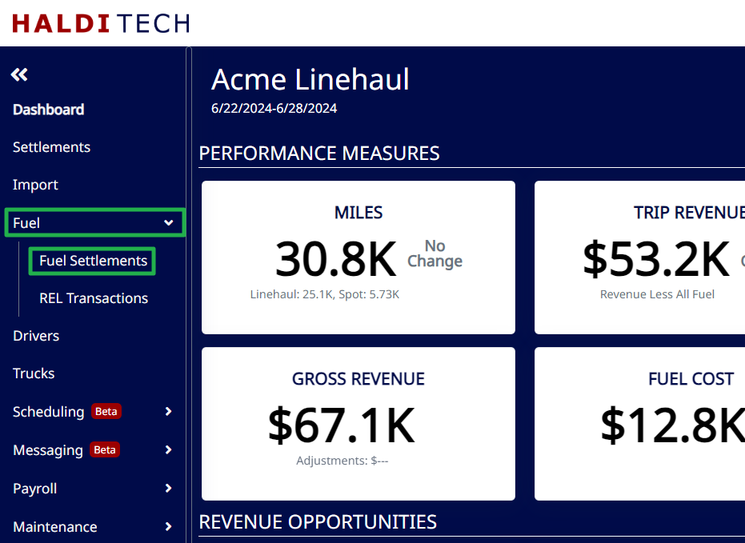
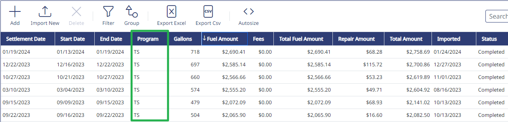
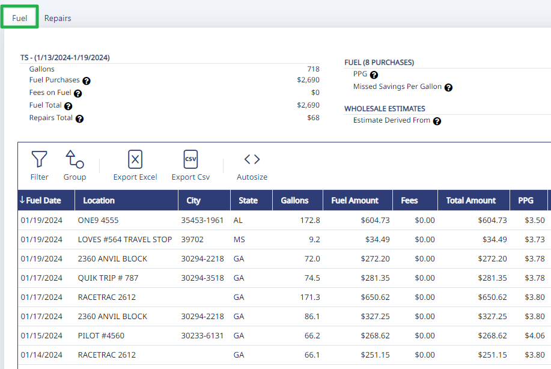

If you have connected your Haldi Tech account to TruckSpy in Integrations, your TruckSpy fuel receipts automatically get pulled into the system.

On the left menu, click on "Fuel", then click on "Fuel Settlements".

This screen shows fuel purchased that isn't on a Tchek card. The TruckSpy fuel card purchases come in automatically, but if you have other 3rd party fuel purchases, you will need to manually upload them.

To see the specifics of the purchases for a given period, double click on the row.

